# 
Python数据分析报告

## 一 前言

​		在数据科学越来越重要的当今社会，对庞大的数据进行分析，处理，找出数据中存在的客观规律，建立描绘群体行为的数学模型，从而对群体行为作出预测，已成为促进社会进步的重要手段。

​		Python编程语言凭借其方便的功能库，精简，易操作的语言风格，在众多编程语言中脱颖而出，成为当今社会进行数据分析的一把利器。

​		而我们认为，Python进行数据分析的重要方式之一是**数据可视化**。

​		本论文讨论了Python在数据分析中如何利用自身的语言优势进行数据可视化并与概率统计知识相结合，从而直观地呈现出现实世界中的一些事件，事件背后的原因，以及事件未来可能的发展。

## 二 Python数据可视化初步

### 2.0 概述

​		在论文第二部分，主要初步介绍Python是如何进行数据可视化的。

​		2.1介绍了数据可视化的概念，即将事件或数据集以图表的形式进行反映，让观看者能够看明白其含义，发现数据集中原本未意识到的规律和意义。

​		2.2介绍了Python如何将常见的数据格式CSV和JSON进行可视化。

​		2.3介绍了Python怎样与API结合来可视化。

### 2.1 数据可视化的概念

​		我们通过运用Python描述日常生活中的现象来解释数据可视化的概念

#### 案例1 利用Matplotlib库

​		本案例来进行绘制散点图模拟水分子无规则运动。如图1，水分子从原点出发，进行5000次任意方向的运动，图上的5000个点代表每次运动后的位置，使水分子无规则运动的路径通过散点图进行呈现，按时间顺序，颜色越深的越晚发生。

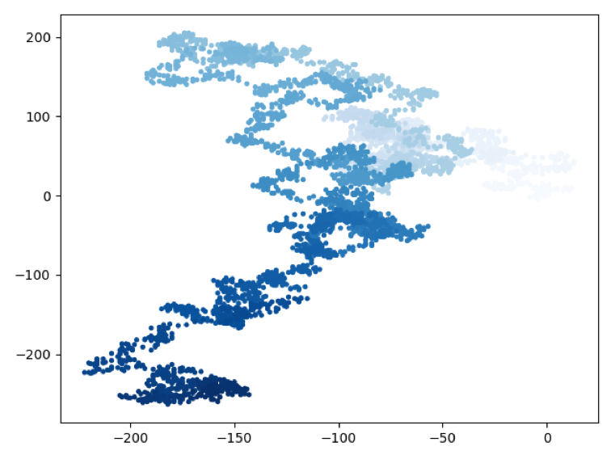

图1 水分子进行5000次运动的位置图

​		从图1可以看出，比起大量数据，通过这些数据生成的散点图可以很直观地模拟出水分子的一个大致运动范围，而毫无规律可循的位置图可以帮助理解水分子运动的“随机”的概念。

#### 案例2 利用Pygal库

​		本案例中统计扔1000次骰子后各点数出现的次数，将其绘制成条形图，如图2所示。

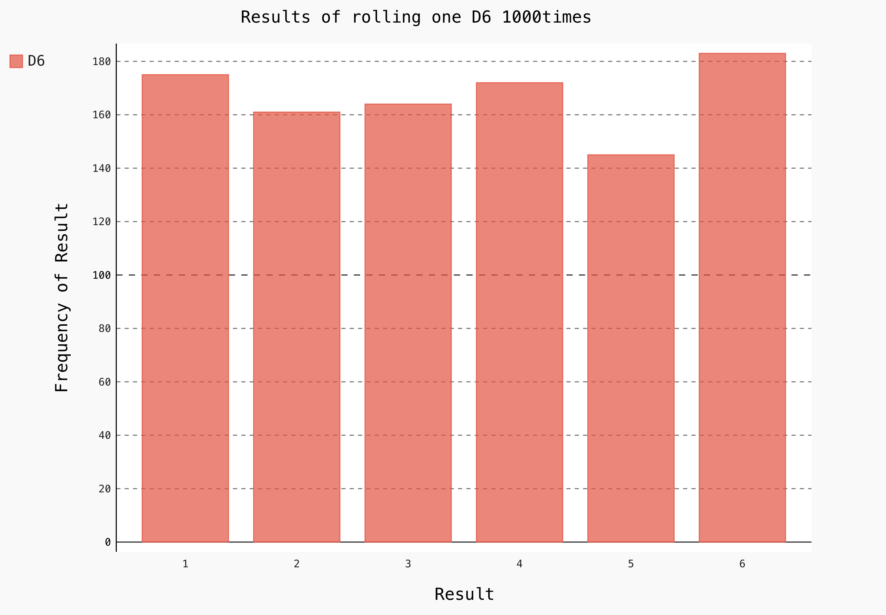

图2 扔1000次骰子后各点数出现的次数

​		条形图可以清楚地对各个次数进行比较，以看出差别。这里取的样本还是偏小，不足以描绘出接近正确的结果

### 2.2 数据可视化与csv和json文件的结合

​		csv文件，即Comma-Separated Values，即逗号分隔值。csv文件是以纯文本的形式来存储表格数据，有时候是数字，有时候是文本。如果只是单纯地人工去分析处理csv文件，是非常困难的，而Python有着非常优秀处理csv文件的能力，只需将文件导入，库中提供的方法会帮助完成分析数据的任务。

​		json文件是一个序列化的对象或是数组，通常应用于前端的数据解析。Python也可以用来解析它们，进行可视化的工作。

​		下面用两个案例来详细说明Python是如何将上述两种文件进行可视化的。

#### 案例3 处理csv文件

​		从天气网站上获得伦敦与多伦多两个地区天气的历史数据并把它们存储为csv格式文件，利用Python获取两个地区每日的最高气温和最低气温，并将气温数据转化为图表进行对比。csv文件如图3所示。

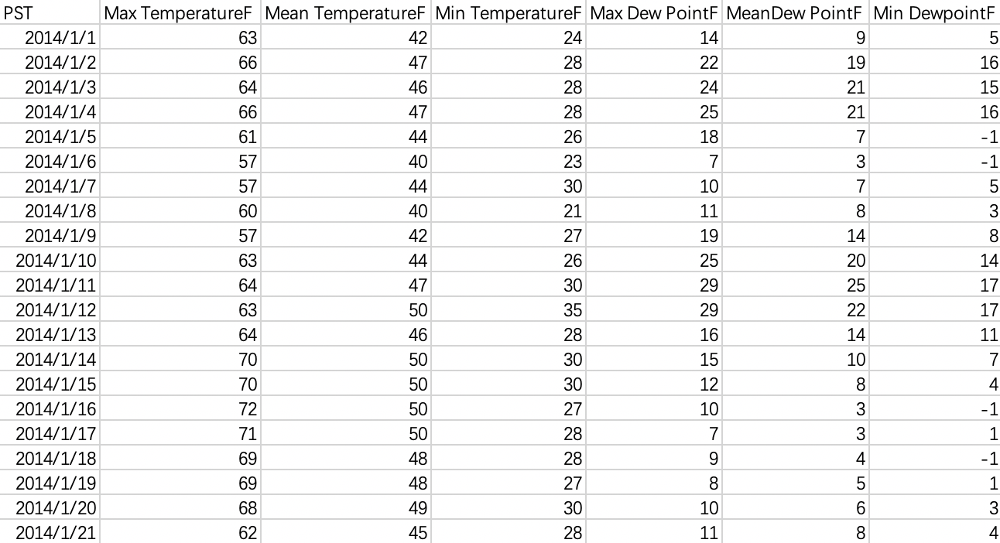

图3 伦敦天气数据（部分）

​		将两个地区一年中每日的最高气温与最低气温分别绘制成图表，如图4和图5所示

图4 伦敦一年中每日最高与最低气温图表

​		同理，我们可以画出多伦多一年中的每日最高温与最低温图表

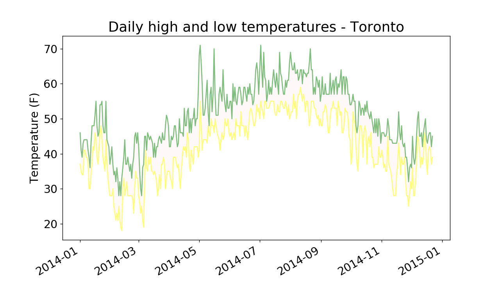

图5 多伦多一年中每日最高与最低气温图表

​		

#### 案例4 处理json文件

​		图6所示为我们从外部网站获取到2017年全年的股票每日收盘价，是以json文件的格式存储的。我们将利用Python来对这些数据进行分析，进而得出一些结论。

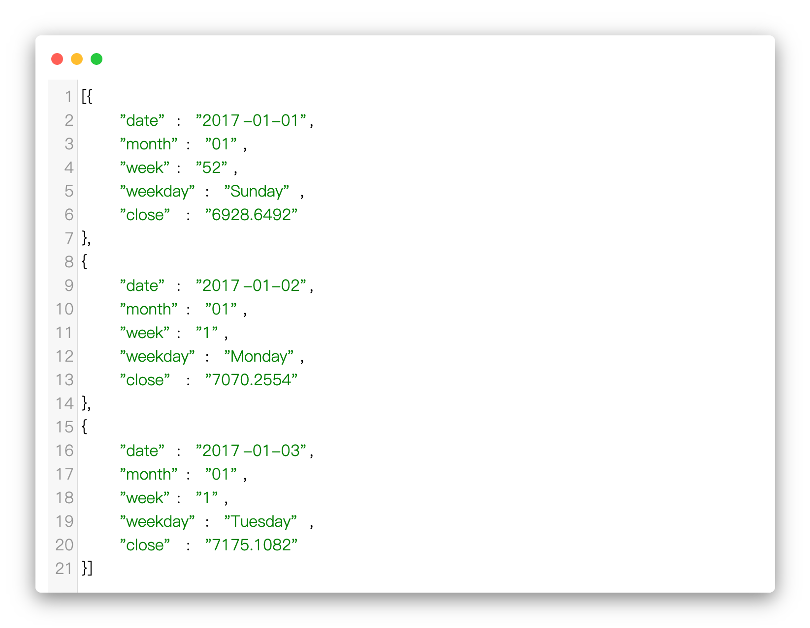

图6 2017年全年股票收盘价（部分）

​		第一步，我们绘制出股票收盘价的折线图。利用2.1中提到的Pygal库

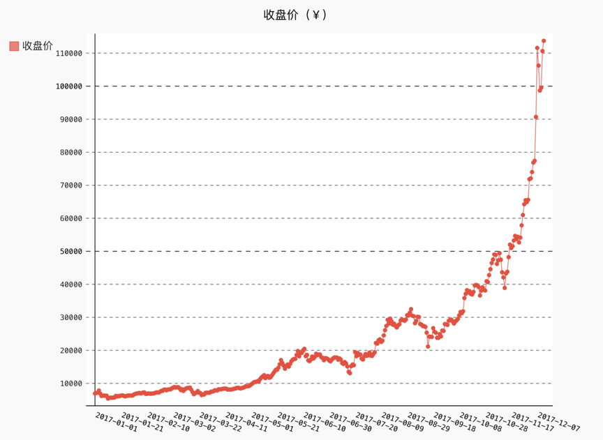

图7 2017年全年股票收盘价折线图

​		从收盘价的折线图可以看出，2017年的总体趋势是非线性的，而且增长幅度不断增大，似乎呈现出指数分布。我们同时发现，在每个季度末,股票收盘价似乎有一些相似的波动。为了验证波动的周期性，我们使用对数变换消除了非线性的趋势。

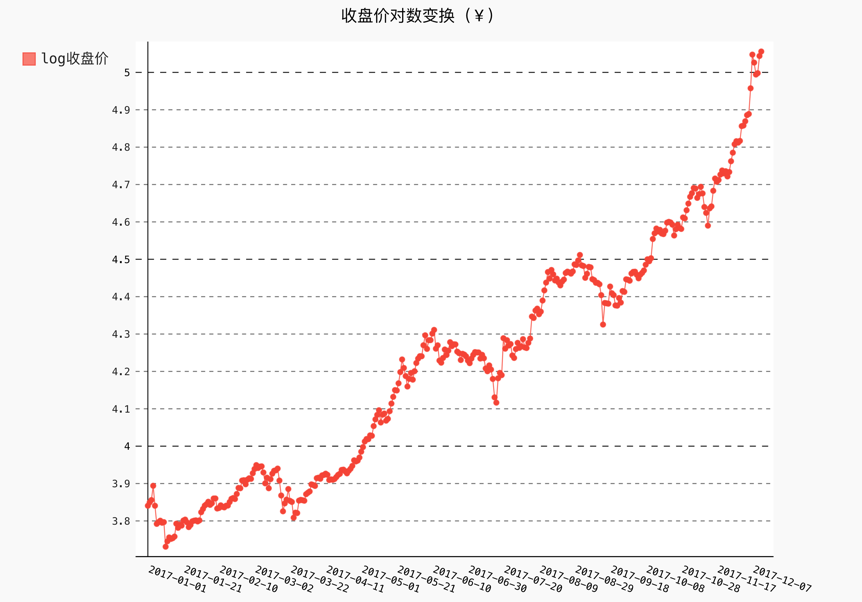

图8 股票收盘价对数变换折线图

​		用对数变换剔除非线性趋势后，整体上涨的趋势更接近线性增长。从图8可以看出，收盘价在3月，6月，9月，即每个季度末都出现了剧烈的波动。为了进一步探求股票价格变化规律的周期性，我们绘制了收盘价的月日均值，周日均值，以及星期均值，分别为图9，图10和图11。

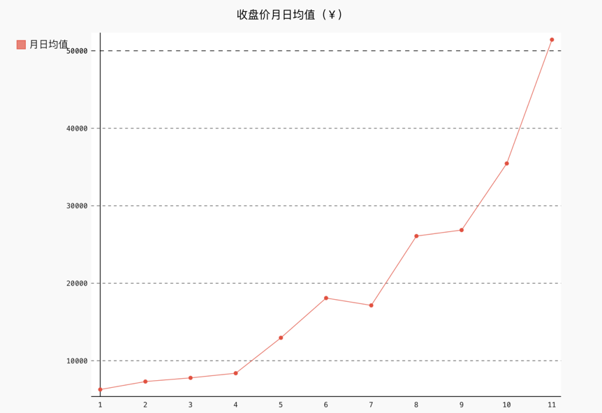

图9 股票收盘价月日均值折线图

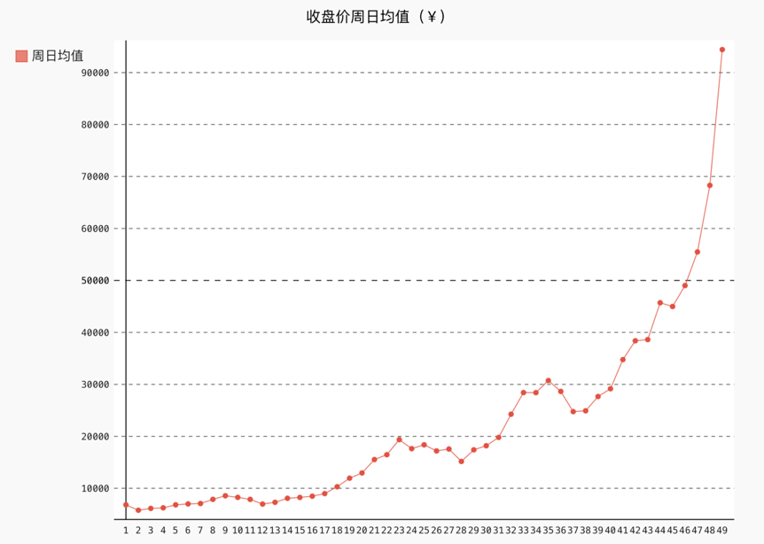

图10 股票收盘价周日均值折线图

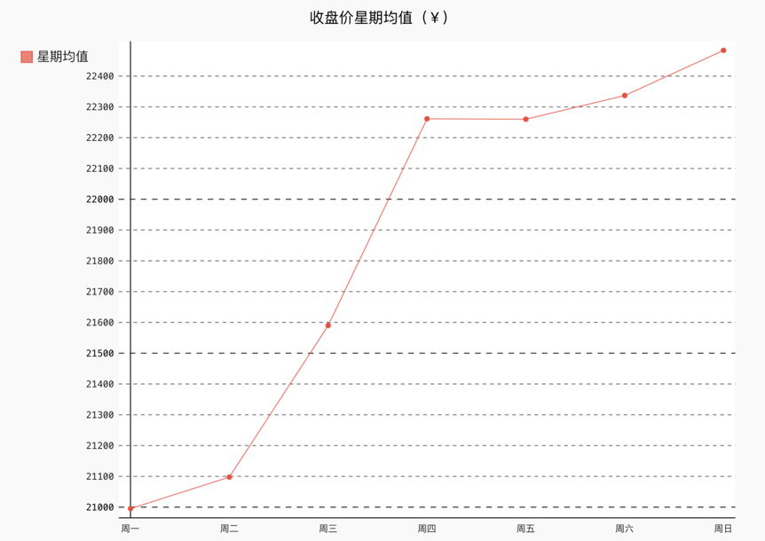

图11 股票收盘价星期均值折线图

### 2.3 与API的结合

​		Web API是网站的一部分，用于与使用非常具体的URL请求特定信息的程序交互。这种请求称为API调用。我们通过Python的reqeust包执行API调用，来获取网站上的数据，进而开始可视化处理。

#### 案例5 得到Github上star数最多的Python项目

​		我们将从Github提供的API中获取到的数据存储在字典中，分析字典中的信息，将所有的Python项目按星从高到低排序，创建一个交互式条形图。处理后所得到的如图12所示。

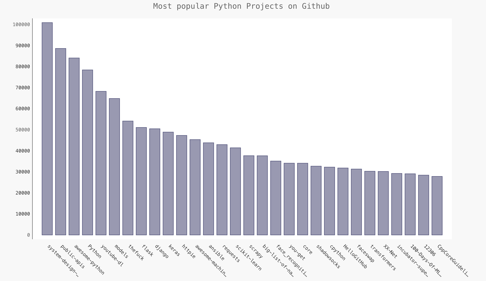

图12 GitHub上受欢迎程度最高的Python项目

​		当我们将鼠标移动到某一条上，就会自动显示出对应的总数，可以看出star数最多的项目是system-design-primer，可以进一步查看star数达到了100857个。

## 三 从实际案例总体来看数据可视化

