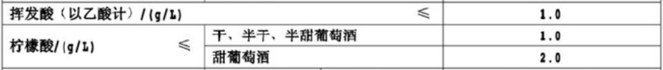
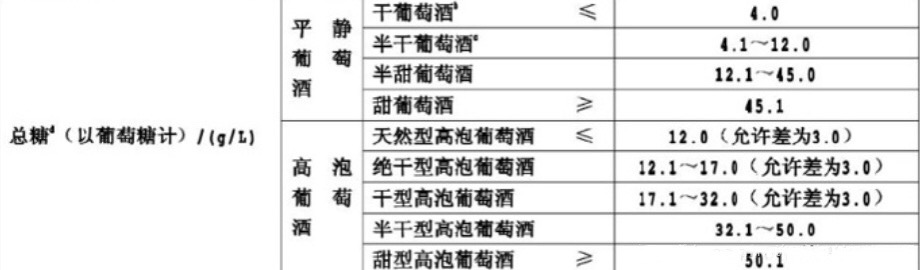
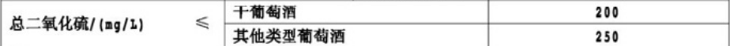
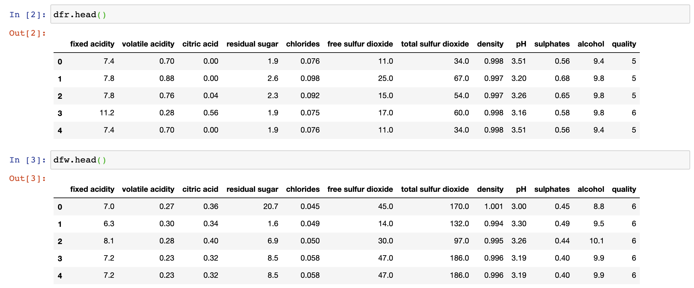
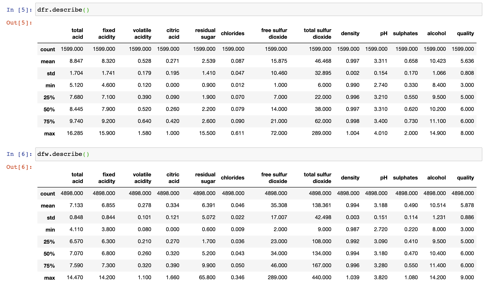
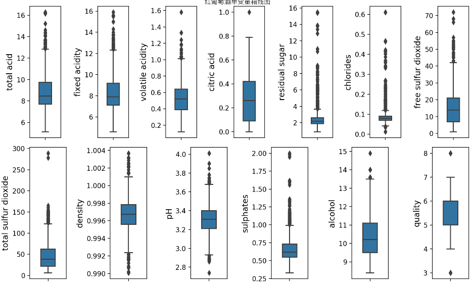
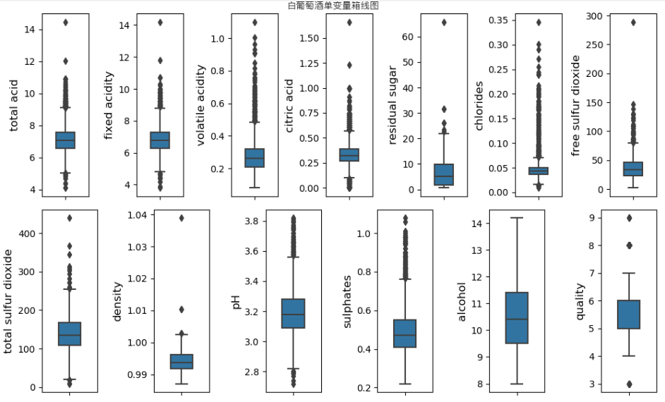

# <center>Python数据分析报告</center>

## 一 前言

​		在数据科学越来越重要的当今社会，对庞大的数据进行分析，处理，找出数据中存在的客观规律，建立描绘群体行为的数学模型，从而对群体行为作出预测，已成为促进社会进步的重要手段。

​		Python编程语言凭借其方便的功能库，精简，易操作的语言风格，在众多编程语言中脱颖而出，成为当今社会进行数据分析的一把利器。

​		而我们认为，Python进行数据分析的重要方式之一是**数据可视化**。

​		本论文讨论了Python在数据分析中如何利用自身的语言优势进行数据可视化并与概率统计知识相结合，从而直观地呈现出现实世界中的一些事件，事件背后的原因，以及事件未来可能的发展。


## 二 Python数据可视化初步

### 2.0 概述

​		在论文第二部分，主要初步介绍Python是如何进行数据可视化的。

​		2.1介绍了数据可视化的概念，即将事件或数据集以图表的形式进行反映，让观看者能够看明白其含义，发现数据集中原本未意识到的规律和意义。

​		2.2介绍了Python如何将常见的数据格式CSV和JSON进行可视化。

​		2.3介绍了Python怎样与API结合来可视化。


### 2.1 数据可视化的概念

​		我们通过运用Python描述日常生活中的现象来解释数据可视化的概念

#### 案例1 利用Matplotlib库

​		本案例来进行绘制散点图模拟水分子无规则运动。如图1，水分子从原点出发，进行5000次任意方向的运动，图上的5000个点代表每次运动后的位置，使水分子无规则运动的路径通过散点图进行呈现，按时间顺序，颜色越深的越晚发生。


<center>图1 水分子进行5000次运动的位置图</center>

​		从图1可以看出，比起大量数据，通过这些数据生成的散点图可以很直观地模拟出水分子的一个大致运动范围，而毫无规律可循的位置图可以帮助理解水分子运动的“随机”的概念。


#### 案例2 利用Pygal库

​		本案例中统计扔1000次骰子后各点数出现的次数，将其绘制成条形图，如图2所示。


<center>图2 扔1000次骰子后各点数出现的次数</center>

​		条形图可以清楚地对各个次数进行比较，以看出差别。这里取的样本还是偏小，不足以描绘出接近正确的结果


### 2.2 数据可视化与csv和json文件的结合

​		csv文件，即Comma-Separated Values，即逗号分隔值。csv文件是以纯文本的形式来存储表格数据，有时候是数字，有时候是文本。如果只是单纯地人工去分析处理csv文件，是非常困难的，而Python有着非常优秀处理csv文件的能力，只需将文件导入，库中提供的方法会帮助完成分析数据的任务。

​		json文件是一个序列化的对象或是数组，通常应用于前端的数据解析。Python也可以用来解析它们，进行可视化的工作。

​		下面用两个案例来详细说明Python是如何将上述两种文件进行可视化的。

#### 案例3 处理csv文件

​		从天气网站上获得伦敦与多伦多两个地区天气的历史数据并把它们存储为csv格式文件，利用Python获取两个地区每日的最高气温和最低气温，并将气温数据转化为图表进行对比。csv文件如图3所示。


<center>图3 伦敦天气数据（部分）</center>

​		将两个地区一年中每日的最高气温与最低气温分别绘制成图表，如图4和图5所示


<center>图4 伦敦一年中每日最高与最低气温图表</center>

​		同理，我们可以画出多伦多一年中的每日最高温与最低温图表


<center>图5 多伦多一年中每日最高与最低气温图表</center>

​		

#### 案例4 处理json文件

​		图6所示为我们从外部网站获取到2017年全年的股票每日收盘价，是以json文件的格式存储的。我们将利用Python来对这些数据进行分析，进而得出一些结论。


<center>图6 2017年全年股票收盘价（部分）</center>

​		第一步，我们绘制出股票收盘价的折线图。利用2.1中提到的Pygal库


<center>图7 2017年全年股票收盘价折线图</center>

​		从收盘价的折线图可以看出，2017年的总体趋势是非线性的，而且增长幅度不断增大，似乎呈现出指数分布。我们同时发现，在每个季度末,股票收盘价似乎有一些相似的波动。为了验证波动的周期性，我们使用对数变换消除了非线性的趋势。


<center>图8 股票收盘价对数变换折线图</center>

​		用对数变换剔除非线性趋势后，整体上涨的趋势更接近线性增长。从图8可以看出，收盘价在3月，6月，9月，即每个季度末都出现了剧烈的波动。为了进一步探求股票价格变化规律的周期性，我们绘制了收盘价的月日均值，周日均值，以及星期均值，分别为图9，图10和图11。


<center>图9 股票收盘价月日均值折线图</center>


<center>图10 股票收盘价周日均值折线图</center>


<center>图11 股票收盘价星期均值折线图</center>


### 2.3 与API的结合

​		Web API是网站的一部分，用于与使用非常具体的URL请求特定信息的程序交互。这种请求称为API调用。我们通过Python的reqeust包执行API调用，来获取网站上的数据，进而开始可视化处理。

#### 案例5 得到Github上star数最多的Python项目

​		我们将从Github提供的API中获取到的数据存储在字典中，分析字典中的信息，将所有的Python项目按星从高到低排序，创建一个交互式条形图。处理后所得到的如图12所示。


<center>图12 GitHub上受欢迎程度最高的Python项目</center>

​		当我们将鼠标移动到某一条上，就会自动显示出对应的总数，可以看出star数最多的项目是system-design-primer，可以进一步查看star数达到了100857个。


## 三 从实际案例总体来看数据可视化

​		第一和第二部分我们介绍了Python关于数据可视化的基本概念，简单理解了其应用。接下来我们将通过完整地分析几个实际案例来展现出如何利用Python进行数据可视化，期间我们也会用到一些数据分析的方法。

​		注：数据集源自网络

### 案例6 葡萄酒品质案例

#### 1. 问题描述

​		数据集存储在源代码文件夹中，包括两种葡萄酒，分别是红葡萄酒和白葡萄酒，还包括了一个数据集说明，这里简单概括一下：

1. 数据量方面，红葡萄酒有1599条记录，白葡萄酒有4898条记录。

2. 输入内容包括客观测试（一共11个，例如有pH值等），输出内容基于感官数据（葡萄酒专家至少进行3次评估的中位数）。每位专家都将葡萄酒的质量评定为0（非常差）至10（非常好）。

3. 关于输入信息说明如下（基于理化性质）：

    + fixed acidity：固定酸
    + volatile acidity：挥发性酸
    + citric acid：柠檬酸
    + residual sugar：残留糖
    + chlorides：氯化物
    + free sulfur dioxide：游离二氧化硫
    + total sulfur dioxide：二氧化硫总量
    + density：密度
    + pH：酸碱值
    + sulphates：硫酸盐
    + alcohol：酒精

    关于输出信息说明如下（基于感官数据）：

    + quality (介于0到10之间)：品质

4. 此外，数据集说明中还提到了一些相关信息，主要可以概括为，葡萄酒的质量并不是均匀分布的，普通的葡萄酒要远多于劣质葡萄酒或优质葡萄酒，因此离群值检测算法可用于检测少数优质或劣质葡萄酒。


#### 2. 思路分析

​		由于本案例是对葡萄酒进行分析，所以我们要对葡萄酒的标准做一些事先了解：

​		（以下部分信息来自葡萄酒新国家标准GB15037-2006）

1. 葡萄酒的基本特征主要有酸度、单宁、酒精和甜味。当这四种特征处于一个良好的平衡状态时，葡萄酒的品质才会最优质

2. 酸主要可分为固定酸和挥发酸，常说的总酸就是两者的总和。葡萄酒中含有许多种酸，主要是酒石酸、苹果酸、柠檬酸、琥珀酸、乳酸、醋酸，挥发酸是葡萄酒中以游离状态或以盐的形式存在的所有乙酸等脂肪酸的总和，但不包括乳酸、琥珀酸以及CO~2~和SO~2~，其中醋酸是主要的挥发酸。挥发酸的含量是葡萄酒健康状态的“体温表”，因为它是发酵、贮藏管理不良留下的标记，通过挥发酸含量的测定可以了解葡萄酒是否生病、病害的严重性以及预测贮藏的困难程度。在国标中对挥发酸和柠檬酸做了明确规定。

    

<center>图13 新国标中对挥发酸和柠檬酸的规定</center>

​		注：总酸不作要求，以实测值表示（以酒石酸记，g/L）

3. pH值是衡量葡萄酒中酸度的程度，一般来说，白葡萄酒的酸度一般在3.1至3.5之间，高于红葡萄酒的3.5至4的区间值。相较而言酸度是衡量葡萄酒中酸含量的多少。

4. 一般来说，酸度对葡萄酒口感的影响要大于pH值，但如果pH值位于一个极端的位置，就会产生较大的影响。总酸度是告诉我们这款酒的浓度，而pH值显示的是这款酒品尝起来口感的浓郁度。例如，在pH值相同的情况下，一款总酸度为6g/L的葡萄酒品尝起来会比总酸度为4g/L的葡萄酒更酸。

5. 残留糖分（简称残糖）是衡量葡萄酒中甜度的标准。通常，残留糖分低于4克/升的葡萄酒为干型葡萄酒，许多干型葡萄酒几乎不含残糖。

    

    	<center>图14 新国标中对糖分的标准</center>

6. 酒精度指葡萄酒中所含酒精的百分比，大部分葡萄酒的酒精度都在10-15%之间，但也有些特殊的葡萄酒，如阿斯蒂（Moscato d’Asti）（酒精度非常低），波特酒（Port）（酒精度非常高）。

    

    <center>图15 新国标中对酒精度的规定</center>

7. 氯化物和硫酸盐都属于葡萄酒中的矿物盐成分，一般来说含量分别是0.1-0.4g/L和0.25-0.85g/L。值得一提的是，虽然这些矿物质成分存在葡萄酒中且可以增强葡萄酒的风味，但它们并不是某些葡萄酒带有矿物风味的主要原因。一般而言，红葡萄酒所含的矿物质多于白葡萄酒。

8. 并不是所有葡萄酒中都会有二氧化硫，但二氧化硫能起到如杀菌、抗氧化、澄清酒液和提高色素和酚类物质含量等作用，因此一般葡萄酒中或多或少地带有一定的二氧化硫，只是整体而言其含量非常少，多为 80-200mg/L，个别葡萄酒中还含有 10-50mg/L 的游离态二氧化硫。不过，适当的摇杯或者醒酒等可以令其挥发掉，因此几乎可以忽略不计。

    

    <center>图16 新国标中对二氧化硫的规定</center>

总结：根据查到的信息，更新输入变量表格如下

|       输入指标       |         说明         |         备注         |
| :------------------: | :------------------: | :------------------: |
|    fixed acidity     |    固定酸（g/L）     |     总酸组成之一     |
|   volatile acidity   |   挥发性酸（g/L）    |     总酸组成之一     |
|     citric acid      |    柠檬酸（g/L）     |      属于固定酸      |
|    residual sugar    |    残留糖（g/L）     |     基本指标之一     |
|      chlorides       |    氯化物（g/L）     |      矿物盐成分      |
| free sulfur dioxide  | 游离二氧化硫（mg/L） |      防腐保鲜剂      |
| total sulfur dioxide | 二氧化硫总量（mg/L） |      防腐保鲜剂      |
|       density        |     密度（g/ml）     |          略          |
|          pH          |        酸碱值        | 酸度的另一种测量角度 |
|      sulphates       |    硫酸盐（g/L）     |      矿物盐成分      |
|       alcohol        |    酒精 （%vol）     |     基本指标之一     |

由此可知，11种输入变量可以大致划分成三类，第一类是基本指标及其内含的个别具体指标，第二类是附加指标（矿物盐、二氧化硫），第三类是密度这个物理性质。


#### 3. 数据分析

##### 3.1 数据整理

使用语言为Python，编程工具为PyCharm和Jupyter Notebook

首先我们导入需要用到的库

```python
import numpy as np
import pandas as pd
import matplotlib.pyplot as plt
import seaborn as sns
from matplotlib import font_manager
```

然后我们进行对数据集文件的读取，文件存放位置与代码目录相同

```python
dfr = pd.read_csv(r'winequality-red.csv', sep=';')
dfw = pd.read_csv(r'winequality-white.csv', sep=';')
```

在打印数据之前，我们还需要对输出格式进行一些处理

```python
# 颜色
color = sns.color_palette()
# 数据print精度
pd.set_option('precision', 3)
# 显示完整的列
pd.set_option('display.max_columns', None)
# 显示完整的行
pd.set_option('display.max_rows', None)
# 设置字体
my_font = font_manager.FontProperties(fname="苹方字体.ttf")
```

我们先打印出两个数据集的head部分



<center>图17</center>

因为总酸作为葡萄酒基本指标值之一，是固定酸和挥发酸的合，所以可以在表中增加一列"total acid"作为总酸，并放置在表格首列：

```python
#增加总酸
dfr['total acid'] = dfr['fixed acidity'] + dfr['volatile acidity']
dfw['total acid'] = dfw['fixed acidity'] + dfw['volatile acidity']
#移动dfr总酸到列首
r = dfr.columns.tolist()
r.insert(0,r.pop())
dfr = dfr.reindex(columns=r)
#移动dfw总酸到列首
r = dfw.columns.tolist()
r.insert(0,r.pop())
dfw = dfw.reindex(columns=r)
```

这样数据集就变成了：



<center>图18</center>

因为不存在值必须唯一的变量且需要分析分类数量，故此处不对数据集进行去重（经试验两个数据集都存在一定数量的重复值），而且经检查不存在异常值。


##### 3.2 分类讨论

11种输入变量可以大致划分成三类，第一类是基本指标及其内含的个别具体指标，第二类是附加指标（矿物盐、二氧化硫），第三类是密度这个物理性质。

###### 3.2.1 描述统计

在统计指标之前，应当对各个变量有直观的分析

**数值描述**

参考图18

由上面结果首先可以知道参与测试的红葡萄酒获得的评分分布在3-8分，白葡萄酒在3-9分，且各分位数数据一致，这说明两种葡萄酒的品质在大体上无明显区别，但具体是否存在细节上的差距还需要进一步分析。另外对于输入变量的各参数，数据表格展示的形式太繁杂不直观，一时看不出什么信息，需要进一步加工成图像便于分析比对。


**箱线图**

我们来绘制两种葡萄酒每个变量的箱线图

```python
# 红葡单变量箱线图
colnum_red = dfr.columns.tolist()
plt.figure(figsize=(10, 6), dpi=200)
plt.suptitle('红葡萄酒单变量箱线图', y=1.00, fontproperties=my_font)  # 总标题
# 画第一行的图
for i in range(7):
    plt.subplot(2, 7, i + 1)
    sns.boxplot(dfr[colnum_red[i]], orient="v", width=0.4, color=color[0])
    plt.ylabel(colnum_red[i], fontsize=12)
plt.tight_layout()
# 画第二行的图
for i in range(6):
    plt.subplot(2, 6, i + 7)
    sns.boxplot(dfr[colnum_red[i + 7]], orient="v", width=0.4, color=color[0])
    plt.ylabel(colnum_red[i + 7], fontsize=12)
plt.tight_layout()
plt.show()
```



<center>图19 红葡萄酒单变量箱线图</center>

（注：这里会报一个warning，但是对结果没有影响）

结合箱线图和刚才的数据表格可以直观了解到各个变量的分布特征，大致归纳如下

| 红葡萄酒变量         | 分布特征                                                     |
| :------------------- | ------------------------------------------------------------ |
| total acidity        | 整体呈正偏，尾长较为对称，高浓度部分存在一定量离群点         |
| fixed acidity        | 整体呈正偏，尾长较为对称，高浓度部分存在一定量离群点，整体分布与总酸相近 |
| volatile acidity     | 整体呈正偏，尾长较为对称，高浓度部分存在一定量离群点，浓度范围低总酸一个数量级 |
| citric acid          | 整体呈正偏，上尾长较长，最小值取到0，有极个别离群点取到1     |
| residual sugar       | 整体呈高度正偏，尾长较为对称，存在大量高浓度离群点           |
| chlorides            | 整体呈高度正偏，尾长较为对称，存在少量低浓度离群点和大量高浓度离群点 |
| free sulfur dioxide  | 整体呈正偏，上尾长较长，存在一定量高浓度离群点               |
| total sulfur dioxide | 整体呈正偏，上尾长较长，存在一定量高浓度离群点且离群点间断大 |
| density              | 整体几乎呈正态分布，上下各有一定量离群点                     |
| pH                   | 整体呈轻度正偏，尾长较为对称，存在少量低值离群点和一定量高值离群点 |
| sulphates            | 整体呈正偏，尾长较为对称，存在较多高浓度离群点               |
| alcohol              | 整体呈正偏，上尾长较长，存在少量高浓度离群点                 |
| quality              | 整体几乎呈正态分布，上下各有极少量离群点                     |

可以大致总结知道，对于红葡萄酒而言，除密度和评分这两项数据分布均匀呈正态之外，其他所有变量都呈现出不同程度的正偏分布，这说明大多数变量都存在可控下限却没有明确的上限，由于品质波动都可能出现较高取值的情况。

同理，我们画出白葡萄酒单变量箱线图

```python
# 白葡单变量箱线图
colnum_white = dfw.columns.tolist()
plt.figure(figsize=(10, 6))
plt.suptitle('白葡萄酒单变量箱线图', y=1.00, fontproperties=my_font)  # 总标题
# 画第一行的图
for i in range(7):
    plt.subplot(2, 7, i + 1)
    sns.boxplot(dfw[colnum_white[i]], orient="v", width=0.4, color=color[0])
    plt.ylabel(colnum_white[i], fontsize=12)
plt.tight_layout()
# 画第二行的图
for i in range(6):
    plt.subplot(2, 6, i + 7)
    sns.boxplot(dfw[colnum_white[i + 7]], orient="v", width=0.4, color=color[0])
    plt.ylabel(colnum_white[i + 7], fontsize=12)
plt.tight_layout()
plt.show()
```



<center>图20 白葡萄酒单变量箱线图</center>

我们也可以得到白葡萄酒各个变量的分布特征

| 白葡萄酒变量         | 分布特征                                                     |
| -------------------- | ------------------------------------------------------------ |
| total acidity        | 整体呈正偏，尾长较为对称，存在少量低离群点和一定量高离群点   |
| fixed acidity        | 整体呈正偏，尾长较为对称，存在少量低离群点和一定量高离群点，整体分布与总酸相近 |
| volatile acidity     | 整体呈正偏，尾长较为对称，存在大量高离群点，浓度范围低总酸一个数量级 |
| citric acid          | 整体呈正偏，尾长较为对称，存在少量低离群点和一定量高离群点   |
| residual sugar       | 整体呈正偏，上尾长较长，存在少量高浓度离群点且离群点间断大   |
| chlorides            | 整体呈高度正偏，尾长较为对称，存在少量低浓度离群点和大量高浓度离群点 |
| free sulfur dioxide  | 整体呈正偏，上尾长较长，存在一定量高浓度离群点且离群点间断大 |
| total sulfur dioxide | 整体呈正偏，尾长较为对称，存在少量低离群点一定量高浓度离群点 |
| density              | 整体呈轻度正偏，存在极少量高离群点                           |
| pH                   | 整体呈轻度正偏，尾长较为对称，存在少量低离群点和一定量高离群点 |
| sulphates            | 整体呈正偏，尾长较为对称，存在较多高浓度离群点               |
| alcohol              | 整体呈正偏，上尾长较长，无离群点                             |
| quality              | 整体几乎呈正态分布，上下各有极少量离群点                     |

可以发现白葡萄酒也是在绝大部分变量上呈现正偏分布，且相比红葡萄酒有更多变量有低离群点，整体上红葡萄酒和白葡萄酒在一些变量上表现不太相同，这些指标可能是造成品类不同的主要因素之一。

我们接下来将两个箱线图放在一起进行观察，可以得出以下结论：

+ 在酸度上白葡萄酒取值低于红葡萄酒且分布更紧凑；
+ 在残留糖浓度上白葡萄酒分布更广泛，相比之下红葡萄酒的分布就很紧凑；
+ 在氯化物浓度上白葡萄酒取值低于红葡萄酒，二者的分布都比较分散；
+ 在二氧化硫浓度上白葡萄酒取值高于红葡萄酒；
+ 在密度上二者的绝大部分取值均低于水的密度，白葡萄酒整体密度更低但分布范围更大；
+ 在pH上二者整体分布相似，白葡萄酒取值整体低于红葡萄酒；
+ 在硫酸盐酸浓度上白葡萄酒整体取值低于红葡萄酒；
+ 在酒精浓度上二者分布相近且离群点很少；
+ 在品质评分上二者十分相近，除白葡萄酒有9分取值外几乎无异；

**直方图**

除了箱线图，还可以通过直方图从另一种角度观察每种变量的分布情况。

```python
# 红葡单变量直方图
colnm = dfr.columns.tolist()
plt.figure(figsize=(16, 20))
plt.suptitle("红葡萄酒单变量直方图\nY轴：频数", y=1.0, fontsize=16, fontproperties=my_font) 
for i in range(9):
    plt.subplot(4, 3, i + 1)
    dfr[colnm[i]].hist(bins=100, color=color[3])
    plt.xlabel(colnm[i], fontsize=14)
plt.tight_layout()
for i in range(4):
    plt.subplot(4, 4, i + 13)
    dfr[colnm[i + 9]].hist(bins=100, color=color[3])
    plt.xlabel(colnm[i + 9], fontsize=14)
plt.tight_layout()
plt.show()

# 白葡单变量直方图
colnm = dfw.columns.tolist()
plt.figure(figsize=(16, 20))
plt.suptitle('白葡萄酒单变量直方图\nY轴：频数', y=1, fontsize=16, fontproperties=my_font) 
for i in range(9):
    plt.subplot(4, 3, i + 1)
    dfw[colnm[i]].hist(bins=100, color=color[4])
    plt.xlabel(colnm[i], fontsize=14)
plt.tight_layout()
for i in range(4):
    plt.subplot(4, 4, i + 13)
    dfw[colnm[i + 9]].hist(bins=100, color=color[4])
    plt.xlabel(colnm[i + 9], fontsize=14)
plt.tight_layout()
plt.show()
```
- 补图21
- 补图22

<center>图21 红葡萄酒单变量直方图</center>
<center>图22 白葡萄酒单变量直方图</center>

当然，也可以将两种葡萄酒的变量直方图放在一张图上进行更为直观的对比分析，结果如下：
```python
colnm_r = dfr.columns.tolist()
colnm_w = dfw.columns.tolist()
plt.figure(figsize=(10, 6))
plt.suptitle('单变量直方图对比', fontsize=14, y=1, fontproperties=my_font) 
for i in range(9):
    y1 = dfr[colnm_r[i]].tolist()
    y2 = dfw[colnm_w[i]].tolist()
    data = []
    data.append(y1)
    data.append(y2)
    plt.subplot(4, 3, i + 1)
    plt.hist(data, bins=100, histtype='bar')
    plt.legend(['红', '白'], prop=my_font)
    plt.xlabel(colnm_r[i], fontsize=12)
plt.tight_layout()
for i in range(4):
    y1 = dfr[colnm_r[i + 9]].tolist()
    y2 = dfw[colnm_w[i + 9]].tolist()
    data = []
    data.append(y1)
    data.append(y2)
    plt.subplot(4, 4, i + 13)
    plt.hist(data, bins=100, histtype='bar')
    plt.legend(['红', '白'], prop=my_font)
    plt.xlabel(colnm_r[i + 9], fontsize=14)
plt.tight_layout()
plt.show()
```
- 补图23
<center>图23 红白葡萄酒单变量直方图</center>

###### 3.2.2 基本指标分析

######  3.2.2.1 酸度分析

输入变量中酸度有关的变量占到了三个，需逐个对其进行分析。首先是固定酸在总酸中的占比，观察占比的分布情况。

```python
# 固定酸占总酸比重
plt.figure(figsize=(10, 4))
plt.suptitle('固定酸占总酸比分布情况', y=1.00, fontsize=16, fontproperties=my_font)  # 总标题
"""红"""
plt.subplot(1, 2, 1)
temp = dfr[{'total acidity', 'fixed acidity'}]
temp['precent'] = temp.apply(lambda x: x['fixed acidity'] / x['total acidity'], axis=1)  # 计算占比
temp['precent'].hist(bins=100, color=color[0])
plt.xlabel('红葡萄酒固定酸占比', fontsize=12, fontproperties=my_font)
plt.ylabel('频数', fontsize=12, fontproperties=my_font)
"""白"""
plt.subplot(1, 2, 2)
temp = dfw[{'total acidity', 'fixed acidity'}]
temp['precent'] = temp.apply(lambda x: x['fixed acidity'] / x['total acidity'], axis=1)  # 计算占比
temp['precent'].hist(bins=100, color=color[0])
plt.xlabel('白葡萄酒固定酸占比', fontsize=12, fontproperties=my_font)
plt.ylabel('频数', fontsize=12, fontproperties=my_font)
plt.show()
```

- 补图24
<center>图24 红白葡萄酒固定酸占总酸比分布图</center>

可以发现红葡萄酒中固定酸的占比比较分散，而白葡萄酒中固定酸的占比则比较集中，形成一个单峰分布。两种葡萄酒的固定酸占比大多数情况下都达到了90%以上。

其次是关于固定酸占总酸比重对评分的影响

```python
# 固定酸占比对评分影响
plt.figure(figsize=(10, 4))
plt.suptitle('固定酸占总酸比对评分的影响', y=1.00, fontsize=16, fontproperties=my_font)  # 总标题
"""红"""
plt.subplot(1, 2, 1)
temp = dfr[{'total acidity', 'fixed acidity', 'quality'}]
temp['precent'] = temp.apply(lambda x: x['fixed acidity'] / x['total acidity'], axis=1)  # 计算占比
sns.boxplot(x=temp['quality'], y=temp['precent'])
plt.xlabel('红葡萄酒评分', fontsize=12, fontproperties=my_font)
plt.ylabel('固定酸占比', fontsize=12, fontproperties=my_font)
"""白"""
plt.subplot(1, 2, 2)
temp = dfw[{'total acidity', 'fixed acidity', 'quality'}]
temp['precent'] = temp.apply(lambda x: x['fixed acidity'] / x['total acidity'], axis=1)  # 计算占比
sns.boxplot(x=temp['quality'], y=temp['precent'])
plt.xlabel('白葡萄酒评分', fontsize=12, fontproperties=my_font)
plt.ylabel('固定酸占比', fontsize=12, fontproperties=my_font)
plt.show()
```

- 补图25
<center>图25 红白葡萄酒固定酸占总酸比影响图</center>

可以发现随着占比的提高，红葡萄酒有更大可能取得较高的评分，而占比的提高对白葡萄酒影响不显著。

柠檬酸是固定酸的一种，若观察固定酸和柠檬酸的关系，首先可以观察柠檬酸在固定酸中占比的分布情况。

```python
# 柠檬酸占固定酸比重
plt.figure(figsize=(10, 4))
plt.suptitle('柠檬酸占固定酸比分布情况', y=1.00, fontsize=16, fontproperties=my_font)  # 总标题
"""红"""
plt.subplot(1, 2, 1)
temp = dfr[{'citric acid', 'fixed acidity'}]
temp['precent'] = temp.apply(lambda x: x['citric acid'] / x['fixed acidity'], axis=1)  # 计算占比
temp['precent'].hist(bins=100, color=color[0])
plt.xlabel('红葡萄酒柠檬酸占比', fontsize=12, fontproperties=my_font)
plt.ylabel('频数', fontsize=12, fontproperties=my_font)
"""白"""
plt.subplot(1, 2, 2)
temp = dfw[{'citric acid', 'fixed acidity'}]
temp['precent'] = temp.apply(lambda x: x['citric acid'] / x['fixed acidity'], axis=1)  # 计算占比
temp['precent'].hist(bins=100, color=color[0])
plt.xlabel('白葡萄酒柠檬酸占比', fontsize=12, fontproperties=my_font)
plt.ylabel('频数', fontsize=12, fontproperties=my_font)
plt.show()

# 柠檬酸占比对评分影响
plt.figure(figsize=(10, 4))
plt.suptitle('柠檬酸占固定酸比对评分的影响', y=1.00, fontsize=16, fontproperties=my_font)  # 总标题
"""红"""
plt.subplot(1, 2, 1)
temp = dfr[{'citric acid', 'fixed acidity', 'quality'}]
temp['precent'] = temp.apply(lambda x: x['citric acid'] / x['fixed acidity'], axis=1)  # 计算占比
sns.boxplot(x=temp['quality'], y=temp['precent'])
plt.xlabel('红葡萄酒评分', fontsize=12, fontproperties=my_font)
plt.ylabel('柠檬酸占比', fontsize=12, fontproperties=my_font)
"""白"""
plt.subplot(1, 2, 2)
temp = dfw[{'citric acid', 'fixed acidity', 'quality'}]
temp['precent'] = temp.apply(lambda x: x['citric acid'] / x['fixed acidity'], axis=1)  # 计算占比
sns.boxplot(x=temp['quality'], y=temp['precent'])
plt.xlabel('白葡萄酒评分', fontsize=12, fontproperties=my_font)
plt.ylabel('柠檬酸占比', fontsize=12, fontproperties=my_font)
plt.show()
```

- 补图26
<center>图26 红白葡萄酒柠檬酸占固定酸比分布图</center>

- 补图27
<center>图27 红白葡萄酒柠檬酸占固定酸比影响图</center>

从两图看出，柠檬酸的占比在红葡萄酒中比较分散，大部分分布于0-8%，且有大量0值。白葡萄酒中柠檬酸占比呈明显的单峰分布，大概集中于4.5%附近。
随着柠檬酸占比的提高，红葡萄酒有更大可能取得较高的评分。而占比的提高对白葡萄酒影响不显著，但过高的占比会导致评分处于中间分段。

挥发酸在评价中属不良指标，所以挥发酸含量对评分的影响应该能形成规律，以此观察挥发酸在总酸中的占比的分布情况

```python
# 挥发酸占总酸比重
plt.figure(figsize=(10, 4))
plt.suptitle('挥发酸占总酸比分布情况', y=1.00, fontsize=16, fontproperties=my_font)  # 总标题
"""红"""
plt.subplot(1, 2, 1)
temp = dfr[{'total acidity', 'volatile acidity'}]
temp['precent'] = temp.apply(lambda x: x['volatile acidity'] / x['total acidity'], axis=1)  # 计算占比
temp['precent'].hist(bins=100, color=color[0])
plt.xlabel('红葡萄酒挥发酸占比', fontsize=12, fontproperties=my_font)
plt.ylabel('频数', fontsize=12, fontproperties=my_font)
"""白"""
plt.subplot(1, 2, 2)
temp = dfw[{'total acidity', 'volatile acidity'}]
temp['precent'] = temp.apply(lambda x: x['volatile acidity'] / x['total acidity'], axis=1)  # 计算占比
temp['precent'].hist(bins=100, color=color[0])
plt.xlabel('白葡萄酒挥发酸占比', fontsize=12, fontproperties=my_font)
plt.ylabel('频数', fontsize=12, fontproperties=my_font)
plt.show()

# 挥发酸占比对评分影响
plt.figure(figsize=(10, 4))
plt.suptitle('挥发酸占总酸比对评分的影响', y=1.00, fontsize=16, fontproperties=my_font)  # 总标题
"""红"""
plt.subplot(1, 2, 1)
temp = dfr[{'total acidity', 'volatile acidity', 'quality'}]
temp['precent'] = temp.apply(lambda x: x['volatile acidity'] / x['total acidity'], axis=1)  # 计算占比
sns.boxplot(x=temp['quality'], y=temp['precent'])
plt.xlabel('红葡萄酒评分', fontsize=12, fontproperties=my_font)
plt.ylabel('挥发酸占比', fontsize=12, fontproperties=my_font)
"""白"""
plt.subplot(1, 2, 2)
temp = dfw[{'total acidity', 'volatile acidity', 'quality'}]
temp['precent'] = temp.apply(lambda x: x['volatile acidity'] / x['total acidity'], axis=1)  # 计算占比
sns.boxplot(x=temp['quality'], y=temp['precent'])
plt.xlabel('白葡萄酒评分', fontsize=12, fontproperties=my_font)
plt.ylabel('挥发酸占比', fontsize=12, fontproperties=my_font)
plt.show()
```

- 补图28
<center>图28 红白葡萄酒挥发酸占总酸比分布图</center>

- 补图29
<center>图29 红白葡萄酒挥发酸占总酸比影响图</center>

可以发现红葡萄酒中挥发酸的占比比较分散，大部分分布在2.5%-10%之间。
而白葡萄酒中固定酸的占比则比较集中，形成一个单峰分布，大概集中在3%附近。

通过观察影响图不难看出，随着挥发酸占比降低，红葡萄酒有更大可能取得较高得分，而占比的降低对白葡萄酒的影响不显著。

对于酸度的考量不只是酸度，pH也是对酸性的度量，只是角度不同，需观察二者对评分结果的影响力是否有差距。

首先是总酸对评分的影响。

```python
# 总酸对评分影响
plt.figure(figsize=(10, 4))
plt.suptitle('总酸含量对评分的影响', y=1.00, fontsize=16, fontproperties=my_font)  # 总标题
"""红"""
plt.subplot(1, 2, 1)
temp = dfr[{'total acidity', 'quality'}]
sns.boxplot(x=temp['quality'], y=temp['total acidity'])
plt.xlabel('红葡萄酒评分', fontsize=12, fontproperties=my_font)
plt.ylabel('总酸含量', fontsize=12, fontproperties=my_font)
"""白"""
plt.subplot(1, 2, 2)
temp = dfw[{'total acidity', 'quality'}]
sns.boxplot(x=temp['quality'], y=temp['total acidity'])
plt.xlabel('白葡萄酒评分', fontsize=12, fontproperties=my_font)
plt.ylabel('总酸含量', fontsize=12, fontproperties=my_font)
plt.show()
```

- 补图30
<center>图30 总酸含量对评分影响</center>

其次是pH值对评分的影响

```python
#pH对评分影响
plt.figure(figsize = (10,4))
plt.suptitle('pH值对评分的影响', y=1.00, fontsize = 16) #总标题
"""红"""
plt.subplot(1,2,1)
temp = dfr[{'pH','quality'}]
sns.boxplot(x=temp['quality'], y=temp['pH'])
plt.xlabel('红葡萄酒评分',fontsize = 12)
plt.ylabel('pH值',fontsize = 12)
"""白"""
plt.subplot(1,2,2)
temp = dfw[{'pH','quality'}]
sns.boxplot(x=temp['quality'], y=temp['pH'])
plt.xlabel('白葡萄酒评分',fontsize = 12)
plt.ylabel('pH值',fontsize = 12)
plt.show()
```

- 补图31
<center>图31 pH值对评分影响</center>

可以发现，总酸含量的变化对红白葡萄酒均没有显著的影响，而pH值的影响较为显著。
有意思的一点是，pH值得降低会使红葡萄酒有更大可能获得高分评价，却使白葡萄酒有更大可能获得低分评价，
它的影响是恰好相反的。

国标中有根据柠檬酸的浓度对葡萄酒分类的标准，此处按这个标椎看一下分类结果


```python
# 按柠檬酸分类
plt.figure(figsize=(10, 4))
plt.suptitle('按柠檬酸含量分类', y=1.00, fontsize=16, fontproperties=my_font)  # 总标题
"""红"""
plt.subplot(1, 2, 1)
temp = pd.cut(dfr['citric acid'], bins=[-0.1, 1, 2], labels=["干、半干、半甜", "甜"])
temp = pd.DataFrame(temp)
temp['citric acid'].value_counts().plot(kind='bar')
num = temp['citric acid'].value_counts()
for x, y in enumerate(num.values):
    plt.text(x, y, "%s" % y, ha='center', va='bottom')  # 显示数字
plt.xticks(rotation=360, fontproperties=my_font)
"""白"""
plt.subplot(1, 2, 2)
temp = pd.cut(dfw['citric acid'], bins=[-0.1, 1, 2.1], labels=["干、半干、半甜", "甜"])
temp = pd.DataFrame(temp)
temp['citric acid'].value_counts().plot(kind='bar')
num = temp['citric acid'].value_counts()
for x, y in enumerate(num.values):
    plt.text(x, y, "%s" % y, ha='center', va='bottom')  # 显示数字
plt.xticks(rotation=360, fontproperties=my_font)
plt.show()
```
- 补图33
<center>图33 依据柠檬酸含量分类</center>

按照国标，实验中所有的红葡萄酒都属于（干、半干、半甜）类，没有甜葡萄酒。

实验中99%的白葡萄酒都属于（干、半干、半甜）类，只有2例甜葡萄酒。

######  3.2.2.2 糖度分析

残留糖作为分析基本指标之一，先观察其对评分的影响

```python
#残留糖对评分影响
plt.figure(figsize = (10,4))
plt.suptitle('残留糖含量对评分的影响', y=1, fontsize = 16) #总标题
"""红"""
plt.subplot(1,2,1)
sns.boxplot(x=dfr['quality'], y=dfr['residual sugar'])
plt.xlabel('红葡萄酒评分',fontsize = 12)
plt.ylabel('残留糖含量',fontsize = 12)
"""白"""
plt.subplot(1,2,2)
sns.boxplot(x=dfw['quality'], y=dfw['residual sugar'])
plt.xlabel('白葡萄酒评分',fontsize = 12)
plt.ylabel('残留糖含量',fontsize = 12)
plt.show()
```

- 补图34
<center>图34 残留糖对评分影响图</center>

除去离群点，各分段的红葡萄酒的残留糖含量都比较相近，可以认为残留糖含量对红葡萄酒的评分影响不大。可以观察到8分红葡和3分红葡的残留糖含量分布区间很相近，而高浓度离群点主要出现在中间分段，不见于高分段和低分段。
类似地，除去离群点，各分段的白葡萄酒的残留糖含量都比较相近，可以认为残留糖含量对白葡萄酒的评分影响不大。可以观察到9分白葡和3分白葡的残留糖含量分布区间很相近，而高浓度离群点主要出现在中间分段，不见于高分段和低分段。

国标中有根据糖分的浓度对葡萄酒分类的标准，此处虽不严格复合（应以葡萄糖计），但也可按这个标椎大致看一下分类结果


适用于柠檬酸的策略，同样的，我们以残留糖进行分类

```python
#按残留糖含量分类
plt.figure(figsize = (10,4))
plt.suptitle('按残留糖含量分类', y=1.0, fontsize = 16) #总标题
"""红"""
plt.subplot(1,2,1)
temp = pd.cut(dfr['residual sugar'], bins=[-0.1, 4, 12, 45,100], labels=["干", "半干", "半甜", "甜"])
temp = pd.DataFrame(temp)
temp['residual sugar'].value_counts().plot(kind='bar')
num = temp['residual sugar'].value_counts()
for x, y in enumerate(num.values):
    plt.text(x, y, "%s" %y, ha='center', va='bottom')
plt.xticks(rotation=360)
"""白"""
plt.subplot(1,2,2)
temp = pd.cut(dfw['residual sugar'], bins=[-0.1, 4, 12, 45,100], labels=["干", "半干", "半甜", "甜"])
temp = pd.DataFrame(temp)
temp['residual sugar'].value_counts().plot(kind='bar')
num = temp['residual sugar'].value_counts()
for x, y in enumerate(num.values):
    plt.text(x, y, "%s" %y, ha='center', va='bottom')
plt.xticks(rotation=360)
plt.show()
```

- 补图36
<center>图36 按残留糖分类图</center>

按照国标，实验中干红葡萄酒有1474例，占92.2%，半干红葡萄酒有117例，占7.3%，半甜红葡萄酒有8例，占0.5%，无甜红葡萄酒
实验中干白葡萄酒有2097例，占42.82%，半干白葡萄酒有1975例，占40.32%，半甜白葡萄酒有825例，占16.84%，甜白葡萄酒1例，占0.02%

######  3.2.2.3 酒精分析

```python
#酒精浓度对评分影响
plt.figure(figsize = (10,4))
plt.suptitle('酒精浓度对评分的影响', y=1.0, fontsize = 16) #总标题
"""红"""
plt.subplot(1,2,1)
sns.boxplot(x=dfr['quality'], y=dfr['alcohol'])
plt.xlabel('红葡萄酒评分',fontsize = 12)
plt.ylabel('酒精浓度',fontsize = 12)
"""白"""
plt.subplot(1,2,2)
sns.boxplot(x=dfw['quality'], y=dfw['alcohol'])
plt.xlabel('白葡萄酒评分',fontsize = 12)
plt.ylabel('酒精浓度',fontsize = 12)
plt.show()
```

- 补图37
<center>图37 酒精浓度对评分影响图</center>

可以发现，对于红白葡萄酒而言，酒精浓度的上升会带来一定的评分上涨趋势，较高的酒精浓度更有可能带来较高的评分。

按国标标准，葡萄酒酒精浓度应不低于7.0
```python
(dfr[dfr['alcohol'] < 7]).alcohol.count()
(dfw[dfw['alcohol'] < 7]).alcohol.count()
```

此处按这个标椎做一下检查，可见均没有不符标准的情况。
- 补图37(结果截图)

###### 3.2.3 附加指标分析

###### 3.2.3.1 矿物盐
```python
#氯化物浓度对评分影响
plt.figure(figsize = (10,4))
plt.suptitle('氯化物浓度对评分的影响', y=1.02, fontsize = 16) #总标题
"""红"""
plt.subplot(1,2,1)
sns.boxplot(x=dfr['quality'], y=dfr['chlorides'])
plt.xlabel('红葡萄酒评分',fontsize = 12)
plt.ylabel('氯化物浓度',fontsize = 12)
"""白"""
plt.subplot(1,2,2)
sns.boxplot(x=dfw['quality'], y=dfw['chlorides'])
plt.xlabel('白葡萄酒评分',fontsize = 12)
plt.ylabel('氯化物浓度',fontsize = 12)
plt.show()
```

- 补图38
<center>图38 氯化物含量对评分影响图</center>

可以发现有一个微弱的随浓度降低评分上升的趋势，总体来说还是不算显著。但若出现较高浓度，则很有可能该评分处于中间分段。

```python
#硫酸盐浓度对评分影响
plt.figure(figsize = (10,4))
plt.suptitle('硫酸盐浓度对评分的影响', y=1.0, fontsize = 16) #总标题
"""红"""
plt.subplot(1,2,1)
sns.boxplot(x=dfr['quality'], y=dfr['sulphates'])
plt.xlabel('红葡萄酒评分',fontsize = 12)
plt.ylabel('硫酸盐浓度',fontsize = 12)
"""白"""
plt.subplot(1,2,2)
sns.boxplot(x=dfw['quality'], y=dfw['sulphates'])
plt.xlabel('白葡萄酒评分',fontsize = 12)
plt.ylabel('硫酸盐浓度',fontsize = 12)
plt.show()
```

- 补图39
<center>图39 硫酸盐含量对评分影响图</center>


可以发现硫酸盐浓度对红葡萄酒的评分有一个较明显影响趋势，随着浓度增加更有可能得到一个较高的评分。

但是不能从硫酸盐浓度有效的估计白葡萄酒的评分，但若出现较高浓度，则很有可能该评分处于中间分段。

###### 3.2.3.2 二氧化硫

首先看一下游离二氧化硫的占比以及其的影响情况

```python
#游离二氧化硫占总二氧化硫比重
plt.figure(figsize = (10,4))
plt.suptitle('游离二氧化硫占总二氧化硫比重分布情况', y=1.0, fontsize = 16) #总标题
"""红"""
plt.subplot(1,2,1)
temp = dfr[{'free sulfur dioxide','total sulfur dioxide'}]
temp['precent'] = temp.apply(lambda x: x['free sulfur dioxide']/x['total sulfur dioxide'], axis=1) #计算占比
temp['precent'].hist(bins = 100, color = color[0])
plt.xlabel('红葡萄酒游离二氧化硫占比',fontsize = 12)
plt.ylabel('频数',fontsize = 12)
"""白"""
plt.subplot(1,2,2)
temp = dfw[{'free sulfur dioxide','total sulfur dioxide'}]
temp['precent'] = temp.apply(lambda x: x['free sulfur dioxide']/x['total sulfur dioxide'], axis=1) #计算占比
temp['precent'].hist(bins = 100, color = color[0])
plt.xlabel('白葡萄酒游离二氧化硫占比',fontsize = 12)
plt.ylabel('频数',fontsize = 12)
plt.show()

#游离二氧化硫占比对评分影响
plt.figure(figsize = (10,4))
plt.suptitle('游离二氧化硫占总二氧化硫比重对评分的影响', y=1.0, fontsize = 16) #总标题
"""红"""
plt.subplot(1,2,1)
temp = dfr[{'free sulfur dioxide','total sulfur dioxide','quality'}]
temp['precent'] = temp.apply(lambda x: x['free sulfur dioxide']/x['total sulfur dioxide'], axis=1)
sns.boxplot(x=temp['quality'], y=temp['precent'])
plt.xlabel('红葡萄酒评分',fontsize = 12)
plt.ylabel('游离二氧化硫占比',fontsize = 12)
"""白"""
plt.subplot(1,2,2)
temp = dfw[{'free sulfur dioxide','total sulfur dioxide','quality'}]
temp['precent'] = temp.apply(lambda x: x['free sulfur dioxide']/x['total sulfur dioxide'], axis=1)
sns.boxplot(x=temp['quality'], y=temp['precent'])
plt.xlabel('白葡萄酒评分',fontsize = 12)
plt.ylabel('游离二氧化硫占比',fontsize = 12)
plt.show()
```

- 补图40
<center>图40 游离二氧化硫含量占比二氧化硫图</center>

- 补图41
<center>图41 游离二氧化硫含量占比对评分影响图</center>

可以发现，仅从游离二氧化硫占总二氧化硫的比重无法有效估计红、白葡萄酒的评分情况。

```python
#二氧化硫总量对评分影响
plt.figure(figsize = (10,4))
plt.suptitle('二氧化硫总量对评分的影响', y=1.0, fontsize = 16) #总标题
"""红"""
plt.subplot(1,2,1)
sns.boxplot(x=dfr['quality'], y=dfr['total sulfur dioxide'])
plt.xlabel('红葡萄酒评分',fontsize = 12)
plt.ylabel('二氧化硫总量',fontsize = 12)
"""白"""
plt.subplot(1,2,2)
sns.boxplot(x=dfw['quality'], y=dfw['total sulfur dioxide'])
plt.xlabel('白葡萄酒评分',fontsize = 12)
plt.ylabel('二氧化硫总量',fontsize = 12)
plt.show()
```

- 补图42
<center>图42 二氧化硫含量对评分影响图</center>

可以发现，仅从二氧化硫的总浓度亦无法有效估计红、白葡萄酒的评分情况，不过若出现高浓度二氧化硫，则有更大可能获得中间段评分。

###### 3.2.4 密度分析

除了之前在描述统计中看到的密度分布情况，这里可以进一步观察密度对评分的影响

```python
#密度对评分影响
plt.figure(figsize = (10,4))
plt.suptitle('密度对评分影响', y=1.0, fontsize = 16) #总标题
"""红"""
plt.subplot(1,2,1)
sns.boxplot(x=dfr['quality'], y=dfr['density'])
plt.xlabel('红葡萄酒评分',fontsize = 12)
plt.ylabel('密度',fontsize = 12)
"""白"""
plt.subplot(1,2,2)
sns.boxplot(x=dfw['quality'], y=dfw['density'])
plt.xlabel('白葡萄酒评分',fontsize = 12)
plt.ylabel('密度',fontsize = 12)
plt.show()
```

- 补图43
<center>图43 密度对评分影响图</center>

可以发现，对于红葡萄酒而言，随着密度的降低会有一个轻微的取得高分的趋势，而对于白葡萄酒而言，密度的变化并不会影响其评分情况。

##### 3.3 综合分析

###### 3.3.1 各变量间的关系

在上一个章节中选择性的查看了大部分输入变量对评分的影响，此处可以进一步将所有输入变量对评分的影响放在一起，类似于总结，可以有一个更加直观的视角。

```python
#红葡各变量与评分关系
colnm = dfr.columns.tolist()[:12]
plt.figure(figsize = (10, 8))
for i in range(12):
    plt.subplot(4,3,i+1)
    sns.boxplot(x ='quality', y = colnm[i], data = dfr, color = color[1], width = 0.6)
    plt.ylabel(colnm[i],fontsize = 12)
plt.suptitle('红葡萄酒各变量与评分关系--箱线图', y=1.0, fontsize=14)
plt.tight_layout()
plt.show()

#白葡各变量与评分关系
colnm = dfw.columns.tolist()[:12]
plt.figure(figsize = (10, 8))
for i in range(12):
    plt.subplot(4,3,i+1)
    sns.boxplot(x ='quality', y = colnm[i], data = dfw, color = color[1], width = 0.6)
    plt.ylabel(colnm[i],fontsize = 12)
plt.suptitle('白葡萄酒各变量与评分关系--箱线图', y=1.0, fontsize=14)
plt.tight_layout()
plt.show()
```

- 补图44
<center>图44 红葡各变量对评分影响图</center>

- 补图45
<center>图45 白葡各变量对评分影响图</center>

综上的直观可以较为清晰的看出各个变量对评分的影响

接下来看一下红白葡萄酒的热力相关图

```python
#红葡热力相关图
plt.figure(figsize = (10,8))
colnm = dfr.columns.tolist()
mcorr = dfr[colnm].corr()
mask = np.zeros_like(mcorr, dtype=np.bool)
mask[np.triu_indices_from(mask)] = True
cmap = sns.diverging_palette(220, 10, as_cmap=True)
sns.heatmap(mcorr, mask=mask, cmap=cmap, square=True, annot=True, fmt='0.2f')
plt.title('红葡萄酒各变量间热力相关图')
plt.show()

#白葡热力相关图
plt.figure(figsize = (10,8))
colnm = dfw.columns.tolist()
mcorr = dfw[colnm].corr()
mask = np.zeros_like(mcorr, dtype=np.bool)
mask[np.triu_indices_from(mask)] = True
cmap = sns.diverging_palette(220, 10, as_cmap=True)
sns.heatmap(mcorr, mask=mask, cmap=cmap, square=True, annot=True, fmt='0.2f')
plt.title('白葡萄酒各变量间热力相关图')
plt.show()
```

- 补图46
<center>图46 红葡热力相关图</center>

可以发现，就红葡萄酒quality得分与各输入变量的相关关系而言，与之前的读图分析结果基本保持一致，只不过是以数值形式进行了量化，此处不复赘述。
而各输入变量之间，可以发现：

- 总酸与固定酸、柠檬酸、密度有较强正相关，与pH有较强负相关；
- 固定酸与柠檬酸、密度有较强正相关，与pH有较强负相关；
- 挥发酸与柠檬酸有较强负相关；
- 柠檬酸与pH有较强负相关；
- 游离二氧化硫与二氧化硫总量有较强正相关；
- 密度与酒精有较强负相关

- 补图47
<center>图47 白葡热力相关图</center>

对于白葡萄酒类似地，各输入变量之间可以发现：

- 总酸与固定酸有较强正相关，与pH有较弱负相关；
- 固定酸与pH有较弱负相关；
- 残留糖浓度与密度有较强正相关，与酒精浓度有较弱负相关；
- 游离二氧化硫与二氧化硫总量有较强正相关；
- 二氧化硫总量与密度有较强正相关，与酒精有较弱负相关；
- 密度与酒精有较强负相关

各种酸之间的相关、酸与pH的相关以及游离二氧化硫和总二氧化硫的相关关系都易于理解。
而密度与酒精浓度的负相关可以进一步作图进行展示
```python
#红葡密度与酒精
plt.figure(figsize = (6,4))
sns.regplot(x='density', y = 'alcohol', data = dfr, scatter_kws = {'s':10}, color = color[0])
plt.title('红葡萄酒密度与酒精的相关关系')
plt.show()

#白葡密度与酒精
plt.figure(figsize = (6,4))
sns.regplot(x='density', y = 'alcohol', data = dfw, scatter_kws = {'s':10}, color = color[0])
plt.title('白葡萄酒密度与酒精的相关关系')
plt.show()
```

- 补图48
<center>图48 红葡密度与酒精相关图</center>

- 补图49
<center>图49 白葡密度与酒精相关图</center>

同理可以制作残留糖与酒精的相关关系

```python
#红葡糖与酒精
plt.figure(figsize = (6,4))
sns.regplot(x='residual sugar', y = 'alcohol', data = dfr, scatter_kws = {'s':10}, color = color[0])
plt.title('红酒残留糖与酒精的相关关系')
plt.show()

#白葡糖与酒精
plt.figure(figsize = (6,4))
sns.regplot(x='residual sugar', y = 'alcohol', data = dfw, scatter_kws = {'s':10}, color = color[0])
plt.title('白葡萄酒残留糖与酒精的相关关系')
plt.show()
```

- 补图50
<center>图50 红葡残留糖与酒精相关图</center>

- 补图51
<center>图51 白葡残留糖与酒精相关图</center>

###### 3.3.2 主成分分析