# <center>Python数据分析报告</center>

## 一 前言

​		在数据科学越来越重要的当今社会，对庞大的数据进行分析，处理，找出数据中存在的客观规律，建立描绘群体行为的数学模型，从而对群体行为作出预测，已成为促进社会进步的重要手段。

​		Python编程语言凭借其方便的功能库，精简，易操作的语言风格，在众多编程语言中脱颖而出，成为当今社会进行数据分析的一把利器。

​		而我们认为，Python进行数据分析的重要方式之一是**数据可视化**。

​		本论文讨论了Python在数据分析中如何利用自身的语言优势进行数据可视化并与概率统计知识相结合，从而直观地呈现出现实世界中的一些事件，事件背后的原因，以及事件未来可能的发展。


## 二 Python数据可视化初步

### 2.0 概述

​		在论文第二部分，主要初步介绍Python是如何进行数据可视化的。

​		2.1介绍了数据可视化的概念，即将事件或数据集以图表的形式进行反映，让观看者能够看明白其含义，发现数据集中原本未意识到的规律和意义。

​		2.2介绍了Python如何将常见的数据格式CSV和JSON进行可视化。

​		2.3介绍了Python怎样与API结合来可视化。

​        2.4 介绍了Python怎样与常见降维方法PCA进行结合
​        2.5 介绍了Python怎样与机器学习KNN算法结合并评估KNN模型的预测能力


### 2.1 数据可视化的概念

​		我们通过运用Python描述日常生活中的现象来解释数据可视化的概念

**案例1 利用Matplotlib库**

​		本案例来进行绘制散点图模拟水分子无规则运动。如图1，水分子从原点出发，进行5000次任意方向的运动，图上的5000个点代表每次运动后的位置，使水分子无规则运动的路径通过散点图进行呈现，按时间顺序，颜色越深的越晚发生。

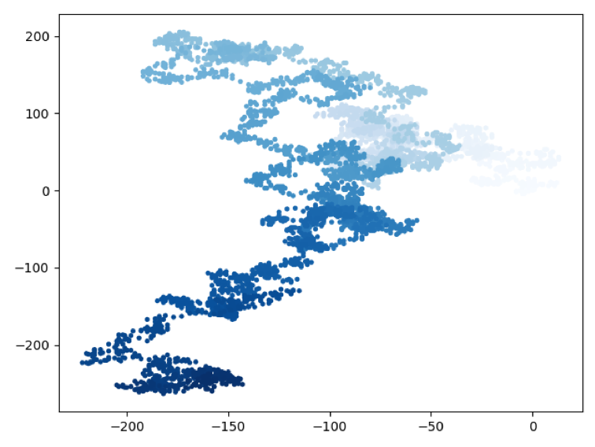

<center>图1 水分子进行5000次运动的位置图</center>

​		从图1可以看出，比起大量数据，通过这些数据生成的散点图可以很直观地模拟出水分子的一个大致运动范围，而毫无规律可循的位置图可以帮助理解水分子运动的“随机”的概念。


**案例2 利用Pygal库**

​		本案例中统计扔1000次骰子后各点数出现的次数，将其绘制成条形图，如图2所示。


<center>图2 扔1000次骰子后各点数出现的次数</center>

​		条形图可以清楚地对各个次数进行比较，以看出差别。这里取的样本还是偏小，不足以描绘出接近正确的结果


### 2.2 数据可视化与csv和json文件的结合

​		csv文件，即Comma-Separated Values，即逗号分隔值。csv文件是以纯文本的形式来存储表格数据，有时候是数字，有时候是文本。如果只是单纯地人工去分析处理csv文件，是非常困难的，而Python有着非常优秀处理csv文件的能力，只需将文件导入，库中提供的方法会帮助完成分析数据的任务。

​		json文件是一个序列化的对象或是数组，通常应用于前端的数据解析。Python也可以用来解析它们，进行可视化的工作。

​		下面用两个案例来详细说明Python是如何将上述两种文件进行可视化的。

**案例3 处理csv文件**

​		从天气网站上获得伦敦与多伦多两个地区天气的历史数据并把它们存储为csv格式文件，利用Python获取两个地区每日的最高气温和最低气温，并将气温数据转化为图表进行对比。csv文件如图3所示。


<center>图3 伦敦天气数据（部分）</center>

​		利用Python得到两个地区一年中每日的最高气温和最低气温，然后将两个地区一年中每日的最高气温与最低气温分别绘制成图表，如图4和图5所示

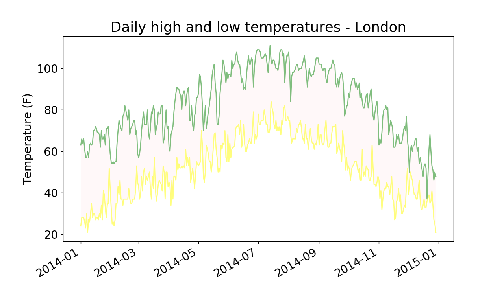

<center>图4 伦敦一年中每日最高与最低气温图表</center>

​		同理，我们可以画出多伦多一年中的每日最高温与最低温图表

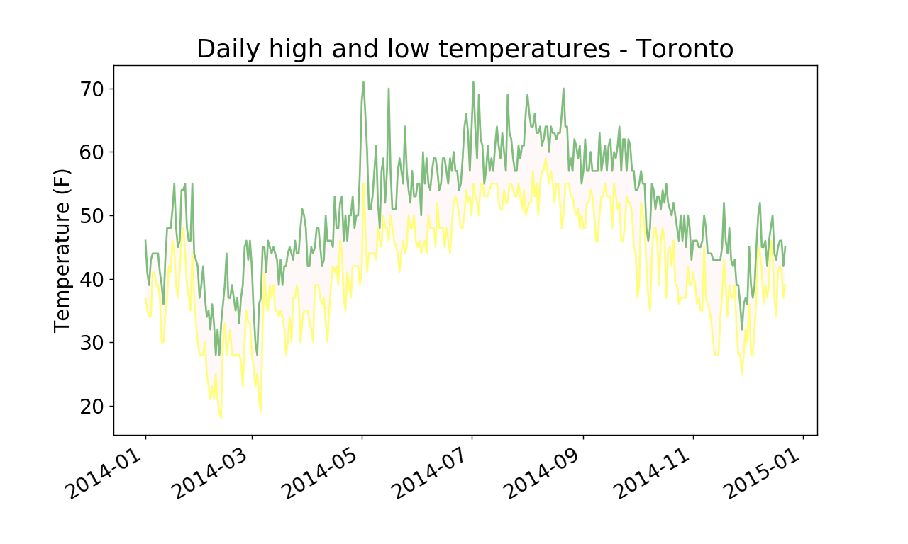

<center>图5 多伦多一年中每日最高与最低气温图表</center>

​		

**案例4 处理json文件**

​		图6所示为我们从外部网站获取到2017年全年的股票每日收盘价，是以json文件的格式存储的。我们将利用Python来对这些数据进行分析，进而得出一些结论。

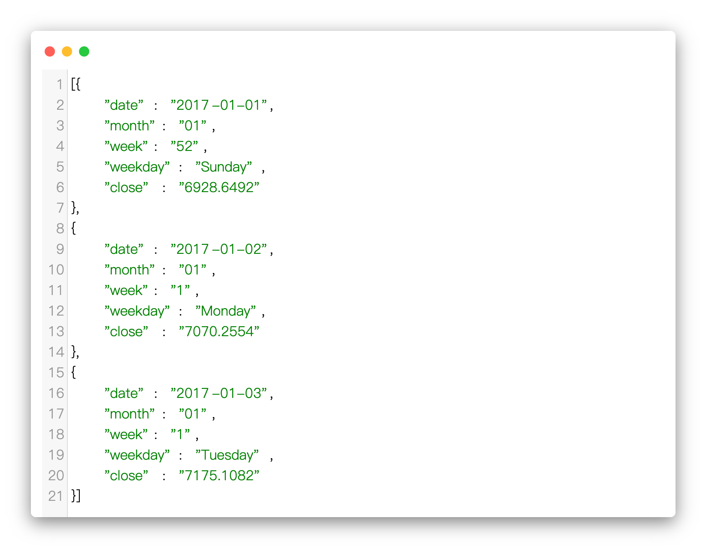

<center>图6 2017年全年股票收盘价（部分）</center>

​		第一步，我们绘制出股票收盘价的折线图。利用2.1中提到的Pygal库


<center>图7 2017年全年股票收盘价折线图</center>

​		从收盘价的折线图可以看出，2017年的总体趋势是非线性的，而且增长幅度不断增大，似乎呈现出指数分布。我们同时发现，在每个季度末,股票收盘价似乎有一些相似的波动。为了验证波动的周期性，我们使用对数变换消除了非线性的趋势。


<center>图8 股票收盘价对数变换折线图</center>

​		用对数变换剔除非线性趋势后，整体上涨的趋势更接近线性增长。从图8可以看出，收盘价在3月，6月，9月，即每个季度末都出现了剧烈的波动。为了进一步探求股票价格变化规律的周期性，我们绘制了收盘价的月日均值，周日均值，以及星期均值，分别为图9，图10和图11。


<center>图9 股票收盘价月日均值折线图</center>

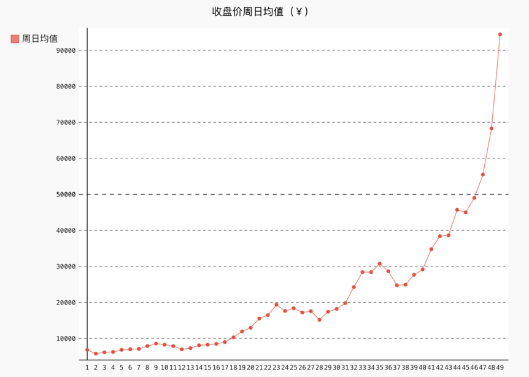

<center>图10 股票收盘价周日均值折线图</center>


<center>图11 股票收盘价星期均值折线图</center>


### 2.3 与API的结合

​		Web API是网站的一部分，用于与使用非常具体的URL请求特定信息的程序交互。这种请求称为API调用。我们通过Python的reqeust包执行API调用，来获取网站上的数据，进而开始可视化处理。

**案例5 得到Github上star数最多的Python项目**       

​		分析方法：我们将从Github提供的API中获取到的数据存储在字典中，分析字典中的信息，将所有的Python项目按星从高到低排序，创建一个交互式条形图。处理后所得到的如图12所示。


<center>图12 GitHub上受欢迎程度最高的Python项目</center>

​		当我们将鼠标移动到某一条上，就会自动显示出对应的总数，可以看出star数最多的项目是system-design-primer，可以进一步查看star数达到了100857个。


### 2.4 数据可视化与降维方法PCA的结合
​		PCA原理： 主成分分析（Principal Component Analysis，PCA）， 是一种统计方法。通过正交变换将一组可能存在相关性的变量转换为一组线性不相关的变量，转换后的这组变量叫主成分。

​		利用的Python函数原型：  sklearn.decomposition.PCA(n_components=None)

​		PCA最常见的应用之一是将高维数据集可视化。

**案例1 处理sklearn里的高维Iris数据集**

​		我们以sklearn中最常见的Iris数据集为例，Iris数据集包含150个样本，分为3类，每个样本具有四个特征。

​		数据集来源： sklearn里的datasets数据集

​		分析方法：从sklearn里的datasets引入Iris数据集

​		调用Sklearn里已经封装好的PCA方法，由于样本特征数大于2已属于高维数据，我们可以使用PCA进行降维，使样本数只包含两个新特征，设置PCA的主成分为2.（具体代码实现位于GitHub仓库中3-2机器学习sk.py）

​		使用Matplotlib里已经封装好的plt方法绘制散点图，直观地表现出两个主成分对Iris类别的影响


**案例2 处理64维数字图像，将其降到2维**

​		数据集来源： https://archive.ics.uci.edu/ml/machine-learning-databases/optdigits/optdigits.tra
​		该数据集包含了3000多个具有64个Feature的数字图像样本，可分为10类。

​		分析方法：引入数据集

​		调用Sklearn里已经封装好的PCA方法，由于样本特征数为64已属于高维数据，我们可以使用PCA进行降维，使样本数只包含两个新特征，设置PCA的主成分为2.（具体代码实现位于GitHub仓库中3-2机器学习sk.py）

​		使用Matplotlib里已经封装好的plt方法绘制图像，直观地表现出两个主成分对I图像类别的影响

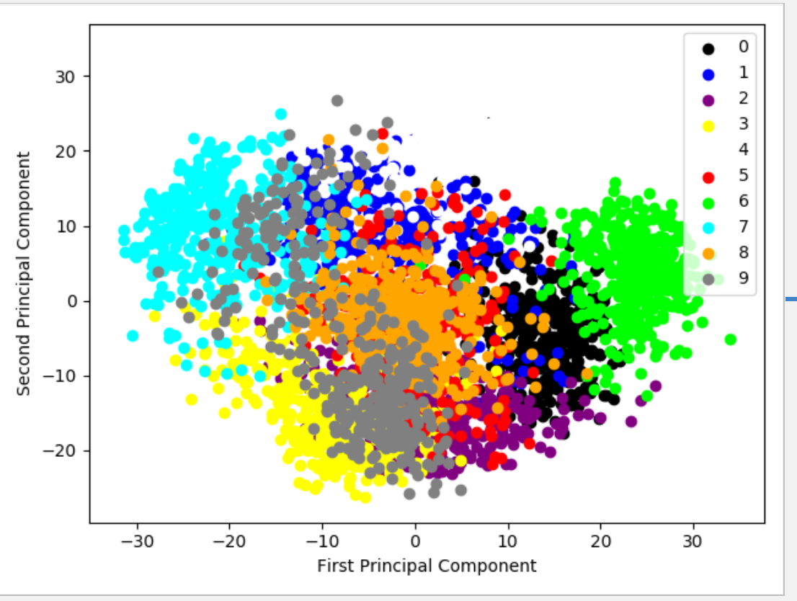

​		图中10种不同的颜色代表样本划分的10个不同的类别，影响样本类别的64个变量因素经过PCA降维后,变成
firstcomponent和secondcomponent两个主成分。


###2.5 数据可视化与机器学习算法KNN的结合
​		KNN算法：是机器学习里监督学习中的一种算法。当对新数据点做出预测时，算法会在训练数据集中找到最近的数据点，也就是它的"最邻近"。

​		例如，如果取k=1，我们想要预测的数据点的结果就是离它最近的训练数据点的值。

​		案例与分析方法：在本例中，我们处理与汽车性能有关的数据集，数据集存储在名为mtcars-clean的CSV文件中，调用Python的Head方法，该数据集大概内容如下：


​		我们想以汽车的weight（重量）作为自变量，用它来预测汽车的mpg值（miles per gallon),所以我们调用sklearn里的test——split方法，取数据集里80%的数据为训练数据，20%的数据为测试数据。划分具体方法如下：
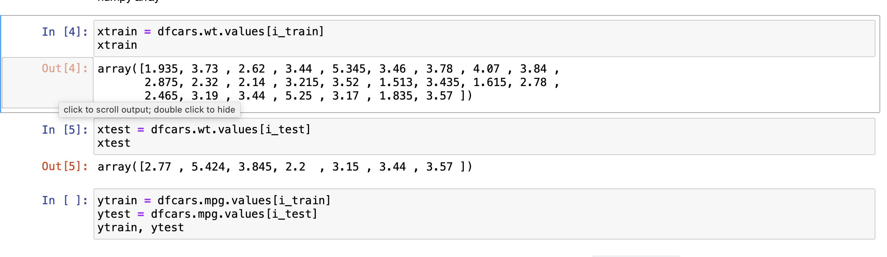

​		利用可视化工具subplot方法可将划分后的数据进行可视化，给人以直观的感受
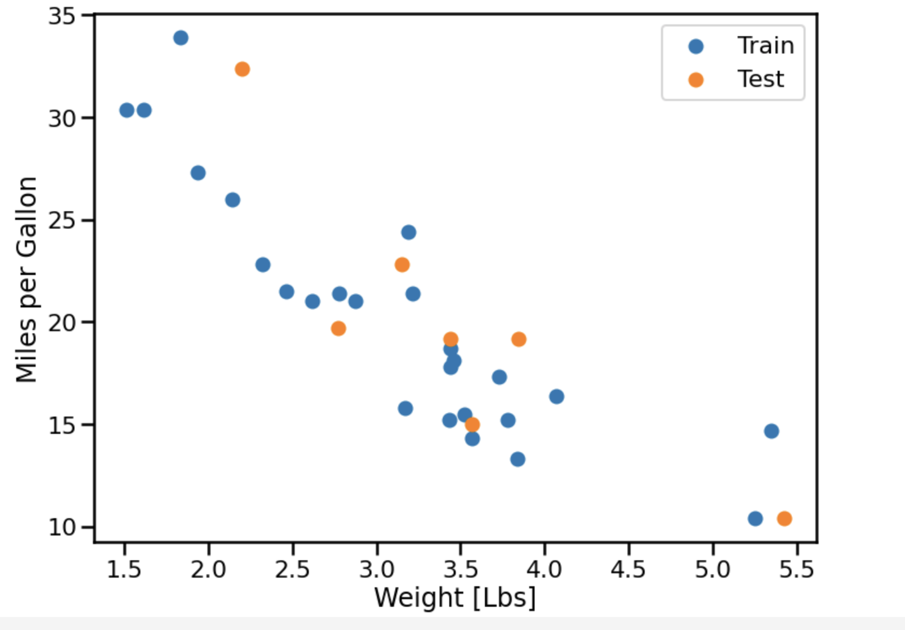

​		接下来我们调用sklearn里已经封装好的KNeighborsRegressor(n_neighbors)方法，让n_neighbors遍历1到14的所有值，利用knn.score方法判断不同K值下KNN算法预测的准确率。
​		我们将KNN的预测正确率随K值变化的情况与不同K值下预测的数据结果全部可视化，以图表的形式给人以直观的感受。

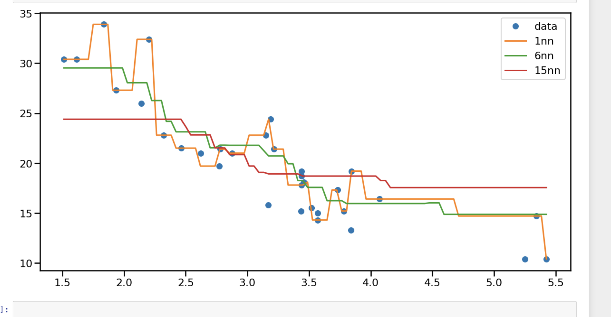

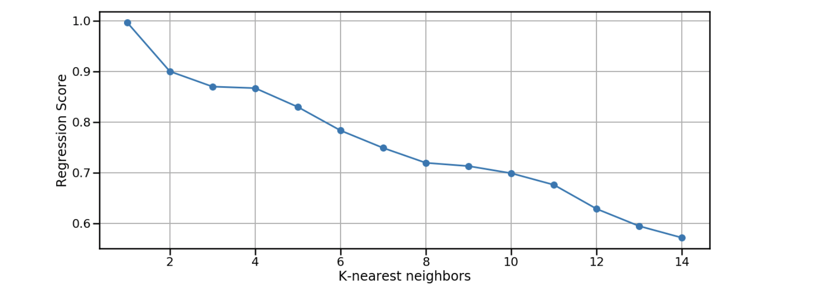


## 三 葡萄酒品质—从实际案例总体来看数据可视化

​		第一和第二部分我们介绍了Python关于数据可视化的基本概念，简单理解了其应用。接下来我们将通过完整地分析一个实际案例来展现出如何利用Python进行数据可视化，期间我们也会用到一些数据分析的方法。

​		注：数据集源自网络

### 1 问题描述

​		数据集存储在源代码文件夹中，包括两种葡萄酒，分别是红葡萄酒和白葡萄酒，还包括了一个数据集说明，这里简单概括一下：

1. 数据量方面，红葡萄酒有1599条记录，白葡萄酒有4898条记录。

2. 输入内容包括客观测试（一共11个，例如有pH值等），输出内容基于感官数据（葡萄酒专家至少进行3次评估的中位数）。每位专家都将葡萄酒的质量评定为0（非常差）至10（非常好）。

3. 关于输入信息说明如下（基于理化性质）：

    + fixed acidity：固定酸
    + volatile acidity：挥发性酸
    + citric acid：柠檬酸
    + residual sugar：残留糖
    + chlorides：氯化物
    + free sulfur dioxide：游离二氧化硫
    + total sulfur dioxide：二氧化硫总量
    + density：密度
    + pH：酸碱值
    + sulphates：硫酸盐
    + alcohol：酒精

    关于输出信息说明如下（基于感官数据）：

    + quality (介于0到10之间)：品质

4. 此外，数据集说明中还提到了一些相关信息，主要可以概括为，葡萄酒的质量并不是均匀分布的，普通的葡萄酒要远多于劣质葡萄酒或优质葡萄酒，因此离群值检测算法可用于检测少数优质或劣质葡萄酒。


### 2 思路分析

​		由于本案例是对葡萄酒进行分析，所以我们要对葡萄酒的标准做一些事先了解：

​		（以下部分信息来自葡萄酒新国家标准GB15037-2006）

1. 葡萄酒的基本特征主要有酸度、单宁、酒精和甜味。当这四种特征处于一个良好的平衡状态时，葡萄酒的品质才会最优质

2. 酸主要可分为固定酸和挥发酸，常说的总酸就是两者的总和。葡萄酒中含有许多种酸，主要是酒石酸、苹果酸、柠檬酸、琥珀酸、乳酸、醋酸，挥发酸是葡萄酒中以游离状态或以盐的形式存在的所有乙酸等脂肪酸的总和，但不包括乳酸、琥珀酸以及CO~2~和SO~2~，其中醋酸是主要的挥发酸。挥发酸的含量是葡萄酒健康状态的“体温表”，因为它是发酵、贮藏管理不良留下的标记，通过挥发酸含量的测定可以了解葡萄酒是否生病、病害的严重性以及预测贮藏的困难程度。在国标中对挥发酸和柠檬酸做了明确规定。

    

<center>图13 新国标中对挥发酸和柠檬酸的规定</center>

​		注：总酸不作要求，以实测值表示（以酒石酸记，g/L）

3. pH值是衡量葡萄酒中酸度的程度，一般来说，白葡萄酒的酸度一般在3.1至3.5之间，高于红葡萄酒的3.5至4的区间值。相较而言酸度是衡量葡萄酒中酸含量的多少。

4. 一般来说，酸度对葡萄酒口感的影响要大于pH值，但如果pH值位于一个极端的位置，就会产生较大的影响。总酸度是告诉我们这款酒的浓度，而pH值显示的是这款酒品尝起来口感的浓郁度。例如，在pH值相同的情况下，一款总酸度为6g/L的葡萄酒品尝起来会比总酸度为4g/L的葡萄酒更酸。

5. 残留糖分（简称残糖）是衡量葡萄酒中甜度的标准。通常，残留糖分低于4克/升的葡萄酒为干型葡萄酒，许多干型葡萄酒几乎不含残糖。

    

    <center>图14 新国标中对糖分的标准</center>

6. 酒精度指葡萄酒中所含酒精的百分比，大部分葡萄酒的酒精度都在10-15%之间，但也有些特殊的葡萄酒，如阿斯蒂（Moscato d’Asti）（酒精度非常低），波特酒（Port）（酒精度非常高）。

    

    <center>图15 新国标中对酒精度的规定</center>

7. 氯化物和硫酸盐都属于葡萄酒中的矿物盐成分，一般来说含量分别是0.1-0.4g/L和0.25-0.85g/L。值得一提的是，虽然这些矿物质成分存在葡萄酒中且可以增强葡萄酒的风味，但它们并不是某些葡萄酒带有矿物风味的主要原因。一般而言，红葡萄酒所含的矿物质多于白葡萄酒。

8. 并不是所有葡萄酒中都会有二氧化硫，但二氧化硫能起到如杀菌、抗氧化、澄清酒液和提高色素和酚类物质含量等作用，因此一般葡萄酒中或多或少地带有一定的二氧化硫，只是整体而言其含量非常少，多为 80-200mg/L，个别葡萄酒中还含有 10-50mg/L 的游离态二氧化硫。不过，适当的摇杯或者醒酒等可以令其挥发掉，因此几乎可以忽略不计。

    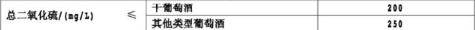

    <center>图16 新国标中对二氧化硫的规定</center>
    
    总结：根据查到的信息，更新输入变量表格如下：

|       输入指标       |         说明         |         备注         |
| :------------------: | :------------------: | :------------------: |
|    fixed acidity     |    固定酸（g/L）     |     总酸组成之一     |
|   volatile acidity   |   挥发性酸（g/L）    |     总酸组成之一     |
|     citric acid      |    柠檬酸（g/L）     |      属于固定酸      |
|    residual sugar    |    残留糖（g/L）     |     基本指标之一     |
|      chlorides       |    氯化物（g/L）     |      矿物盐成分      |
| free sulfur dioxide  | 游离二氧化硫（mg/L） |      防腐保鲜剂      |
| total sulfur dioxide | 二氧化硫总量（mg/L） |      防腐保鲜剂      |
|       density        |     密度（g/ml）     |          略          |
|          pH          |        酸碱值        | 酸度的另一种测量角度 |
|      sulphates       |    硫酸盐（g/L）     |      矿物盐成分      |
|       alcohol        |    酒精 （%vol）     |     基本指标之一     |

​		由此可知，11种输入变量可以大致划分成三类，第一类是基本指标及其内含的个别具体指标，第二类是附加指标（矿物盐、二氧化硫），第三类是密度这个物理性质。


### 3 数据分析

#### 3.1 数据整理

使用语言为Python，编程工具为PyCharm和Jupyter Notebook

首先我们导入需要用到的库

```python
import numpy as np
import pandas as pd
import matplotlib.pyplot as plt
import seaborn as sns
from matplotlib import font_manager
```

然后我们进行对数据集文件的读取，文件存放位置与代码目录相同

```python
dfr = pd.read_csv(r'winequality-red.csv', sep=';')
dfw = pd.read_csv(r'winequality-white.csv', sep=';')
```

在打印数据之前，我们还需要对输出格式进行一些处理

```python
# 颜色
color = sns.color_palette()
# 数据print精度
pd.set_option('precision', 3)
# 显示完整的列
pd.set_option('display.max_columns', None)
# 显示完整的行
pd.set_option('display.max_rows', None)
# 设置字体
my_font = font_manager.FontProperties(fname="苹方字体.ttf")
```

我们先打印出两个数据集的head部分


<center>图17</center>

因为总酸作为葡萄酒基本指标值之一，是固定酸和挥发酸的合，所以可以在表中增加一列"total acid"作为总酸，并放置在表格首列：

```python
#增加总酸
dfr['total acid'] = dfr['fixed acidity'] + dfr['volatile acidity']
dfw['total acid'] = dfw['fixed acidity'] + dfw['volatile acidity']
#移动dfr总酸到列首
r = dfr.columns.tolist()
r.insert(0,r.pop())
dfr = dfr.reindex(columns=r)
#移动dfw总酸到列首
r = dfw.columns.tolist()
r.insert(0,r.pop())
dfw = dfw.reindex(columns=r)
```

这样数据集就变成了：

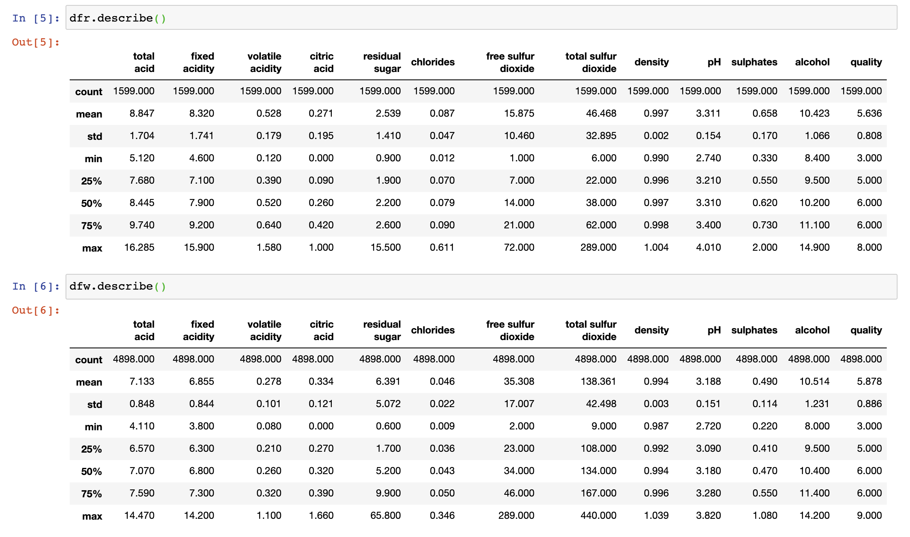

<center>图18</center>

因为不存在值必须唯一的变量且需要分析分类数量，故此处不对数据集进行去重（经试验两个数据集都存在一定数量的重复值），而且经检查不存在异常值。


#### 3.2 分类讨论

11种输入变量可以大致划分成三类，第一类是基本指标及其内含的个别具体指标，第二类是附加指标（矿物盐、二氧化硫），第三类是密度这个物理性质。

##### 3.2.1 描述统计

在统计指标之前，应当对各个变量有直观的分析

**数值描述**：

参考图18

由上面结果首先可以知道参与测试的红葡萄酒获得的评分分布在3-8分，白葡萄酒在3-9分，且各分位数数据一致，这说明两种葡萄酒的品质在大体上无明显区别，但具体是否存在细节上的差距还需要进一步分析。另外对于输入变量的各参数，数据表格展示的形式太繁杂不直观，一时看不出什么信息，需要进一步加工成图像便于分析比对。

**箱线图**：

我们来绘制两种葡萄酒每个变量的箱线图

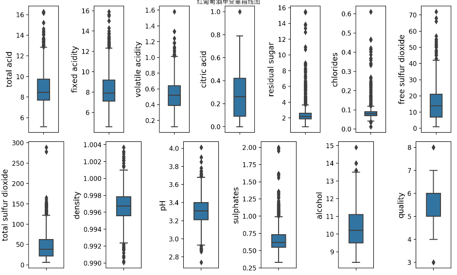

<center>图19 红葡萄酒单变量箱线图</center>

结合箱线图和刚才的数据表格可以直观了解到各个变量的分布特征，大致归纳如下

| 红葡萄酒变量         | 分布特征                                                     |
| :------------------- | ------------------------------------------------------------ |
| total acidity        | 整体呈正偏，尾长较为对称，高浓度部分存在一定量离群点         |
| fixed acidity        | 整体呈正偏，尾长较为对称，高浓度部分存在一定量离群点，整体分布与总酸相近 |
| volatile acidity     | 整体呈正偏，尾长较为对称，高浓度部分存在一定量离群点，浓度范围低总酸一个数量级 |
| citric acid          | 整体呈正偏，上尾长较长，最小值取到0，有极个别离群点取到1     |
| residual sugar       | 整体呈高度正偏，尾长较为对称，存在大量高浓度离群点           |
| chlorides            | 整体呈高度正偏，尾长较为对称，存在少量低浓度离群点和大量高浓度离群点 |
| free sulfur dioxide  | 整体呈正偏，上尾长较长，存在一定量高浓度离群点               |
| total sulfur dioxide | 整体呈正偏，上尾长较长，存在一定量高浓度离群点且离群点间断大 |
| density              | 整体几乎呈正态分布，上下各有一定量离群点                     |
| pH                   | 整体呈轻度正偏，尾长较为对称，存在少量低值离群点和一定量高值离群点 |
| sulphates            | 整体呈正偏，尾长较为对称，存在较多高浓度离群点               |
| alcohol              | 整体呈正偏，上尾长较长，存在少量高浓度离群点                 |
| quality              | 整体几乎呈正态分布，上下各有极少量离群点                     |

可以大致总结知道，对于红葡萄酒而言，除密度和评分这两项数据分布均匀呈正态之外，其他所有变量都呈现出不同程度的正偏分布，这说明大多数变量都存在可控下限却没有明确的上限，由于品质波动都可能出现较高取值的情况。

同理，我们画出白葡萄酒单变量箱线图

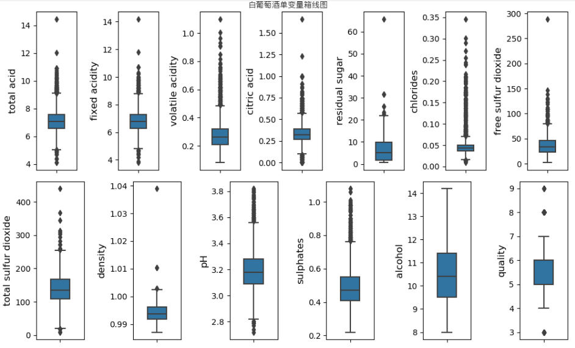

<center>图20 白葡萄酒单变量箱线图</center>

我们也可以得到白葡萄酒各个变量的分布特征

| 白葡萄酒变量         | 分布特征                                                     |
| -------------------- | ------------------------------------------------------------ |
| total acidity        | 整体呈正偏，尾长较为对称，存在少量低离群点和一定量高离群点   |
| fixed acidity        | 整体呈正偏，尾长较为对称，存在少量低离群点和一定量高离群点，整体分布与总酸相近 |
| volatile acidity     | 整体呈正偏，尾长较为对称，存在大量高离群点，浓度范围低总酸一个数量级 |
| citric acid          | 整体呈正偏，尾长较为对称，存在少量低离群点和一定量高离群点   |
| residual sugar       | 整体呈正偏，上尾长较长，存在少量高浓度离群点且离群点间断大   |
| chlorides            | 整体呈高度正偏，尾长较为对称，存在少量低浓度离群点和大量高浓度离群点 |
| free sulfur dioxide  | 整体呈正偏，上尾长较长，存在一定量高浓度离群点且离群点间断大 |
| total sulfur dioxide | 整体呈正偏，尾长较为对称，存在少量低离群点一定量高浓度离群点 |
| density              | 整体呈轻度正偏，存在极少量高离群点                           |
| pH                   | 整体呈轻度正偏，尾长较为对称，存在少量低离群点和一定量高离群点 |
| sulphates            | 整体呈正偏，尾长较为对称，存在较多高浓度离群点               |
| alcohol              | 整体呈正偏，上尾长较长，无离群点                             |
| quality              | 整体几乎呈正态分布，上下各有极少量离群点                     |

可以发现白葡萄酒也是在绝大部分变量上呈现正偏分布，且相比红葡萄酒有更多变量有低离群点，整体上红葡萄酒和白葡萄酒在一些变量上表现不太相同，这些指标可能是造成品类不同的主要因素之一。

我们接下来将两个箱线图放在一起进行观察，可以得出以下结论：

+ 在酸度上白葡萄酒取值低于红葡萄酒且分布更紧凑；
+ 在残留糖浓度上白葡萄酒分布更广泛，相比之下红葡萄酒的分布就很紧凑；
+ 在氯化物浓度上白葡萄酒取值低于红葡萄酒，二者的分布都比较分散；
+ 在二氧化硫浓度上白葡萄酒取值高于红葡萄酒；
+ 在密度上二者的绝大部分取值均低于水的密度，白葡萄酒整体密度更低但分布范围更大；
+ 在pH上二者整体分布相似，白葡萄酒取值整体低于红葡萄酒；
+ 在硫酸盐酸浓度上白葡萄酒整体取值低于红葡萄酒；
+ 在酒精浓度上二者分布相近且离群点很少；
+ 在品质评分上二者十分相近，除白葡萄酒有9分取值外几乎无异；

**直方图**

除了箱线图，还可以通过直方图从另一种角度观察每种变量的分布情况。

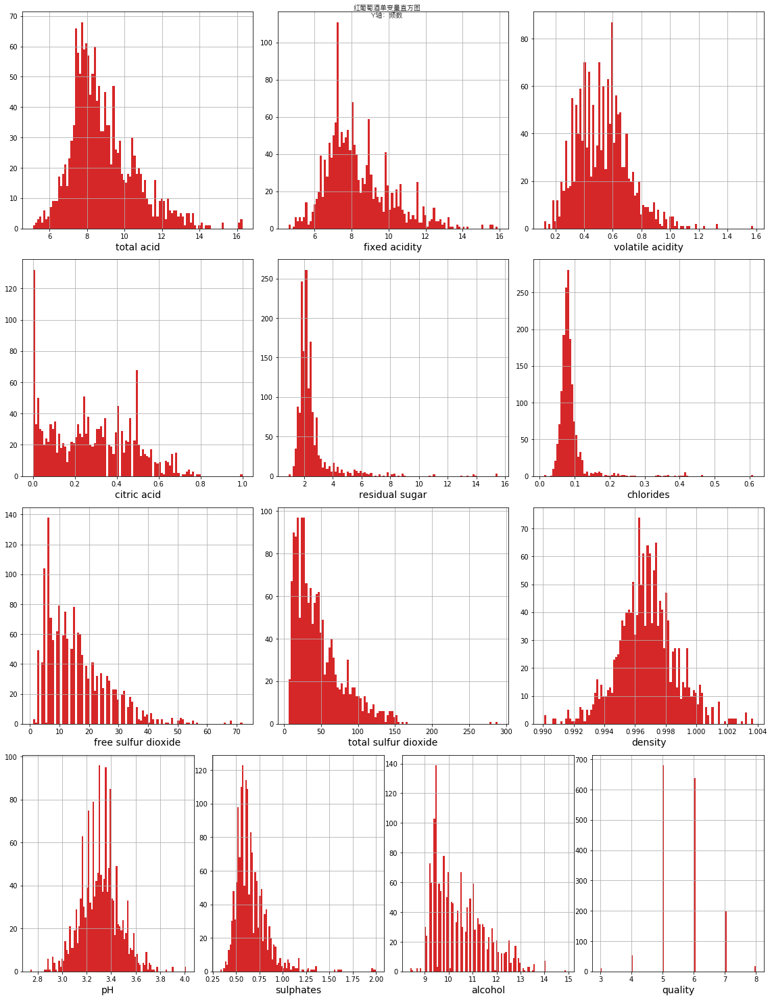
<center>图21 红葡萄酒单变量直方图</center>

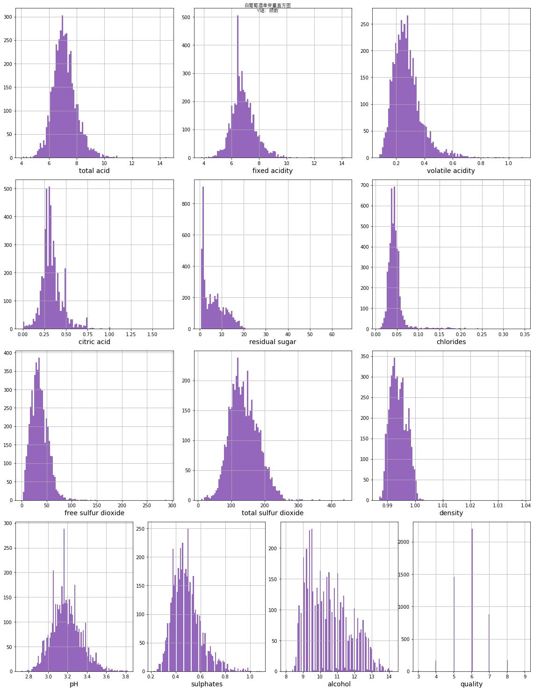
<center>图22 白葡萄酒单变量直方图</center>


当然，也可以将两种葡萄酒的变量直方图放在一张图上进行更为直观的对比分析，结果如下：

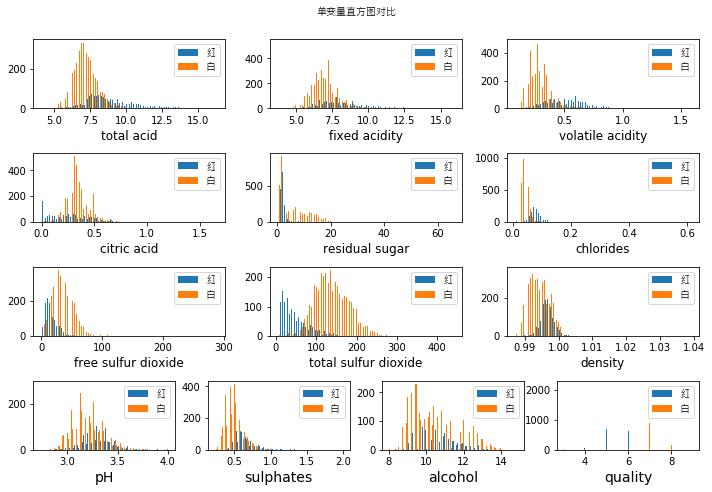
<center>图23 红白葡萄酒单变量直方图</center>


##### 3.2.2 基本指标分析

**酸度分析**

输入变量中酸度有关的变量占到了三个，需逐个对其进行分析。首先是固定酸在总酸中的占比，观察占比的分布情况。

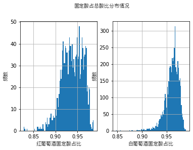
<center>图24 红白葡萄酒固定酸占总酸比分布图</center>

可以发现红葡萄酒中固定酸的占比比较分散，而白葡萄酒中固定酸的占比则比较集中，形成一个单峰分布。两种葡萄酒的固定酸占比大多数情况下都达到了90%以上。

其次是关于固定酸占总酸比重对评分的影响

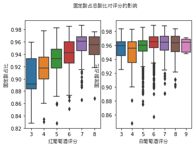
<center>图25 红白葡萄酒固定酸占总酸比影响图</center>

可以发现随着占比的提高，红葡萄酒有更大可能取得较高的评分，而占比的提高对白葡萄酒影响不显著。

柠檬酸是固定酸的一种，若观察固定酸和柠檬酸的关系，首先可以观察柠檬酸在固定酸中占比的分布情况。

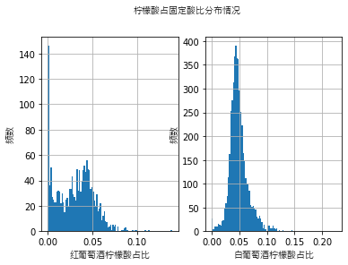
<center>图26 红白葡萄酒柠檬酸占固定酸比分布图</center>

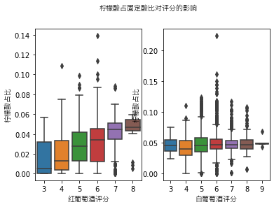
<center>图27 红白葡萄酒柠檬酸占固定酸比影响图</center>

从两图看出，柠檬酸的占比在红葡萄酒中比较分散，大部分分布于0-8%，且有大量0值。白葡萄酒中柠檬酸占比呈明显的单峰分布，大概集中于4.5%附近。
随着柠檬酸占比的提高，红葡萄酒有更大可能取得较高的评分。而占比的提高对白葡萄酒影响不显著，但过高的占比会导致评分处于中间分段。

挥发酸在评价中属不良指标，所以挥发酸含量对评分的影响应该能形成规律，以此观察挥发酸在总酸中的占比的分布情况

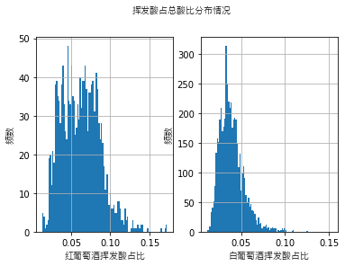
<center>图28 红白葡萄酒挥发酸占总酸比分布图</center>

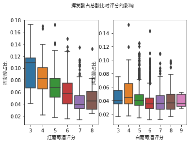
<center>图29 红白葡萄酒挥发酸占总酸比影响图</center>

可以发现红葡萄酒中挥发酸的占比比较分散，大部分分布在2.5%-10%之间。
而白葡萄酒中固定酸的占比则比较集中，形成一个单峰分布，大概集中在3%附近。

通过观察影响图不难看出，随着挥发酸占比降低，红葡萄酒有更大可能取得较高得分，而占比的降低对白葡萄酒的影响不显著。

对于酸度的考量不只是酸度，pH也是对酸性的度量，只是角度不同，需观察二者对评分结果的影响力是否有差距。

首先是总酸对评分的影响：

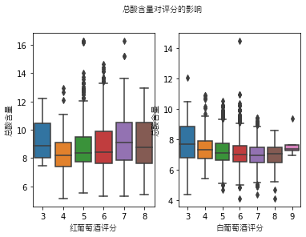
<center>图30 总酸含量对评分影响</center>

其次是pH值对评分的影响

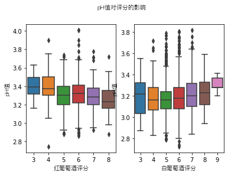
<center>图31 pH值对评分影响</center>

可以发现，总酸含量的变化对红白葡萄酒均没有显著的影响，而pH值的影响较为显著。
有意思的一点是，pH值得降低会使红葡萄酒有更大可能获得高分评价，却使白葡萄酒有更大可能获得低分评价，
它的影响是恰好相反的。

国标中有根据柠檬酸的浓度对葡萄酒分类的标准，此处按这个标椎看一下分类结果


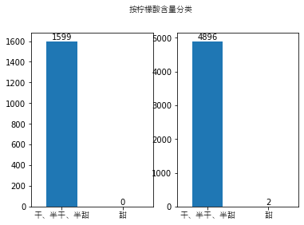
<center>图33 依据柠檬酸含量分类</center>

按照国标，实验中所有的红葡萄酒都属于（干、半干、半甜）类，没有甜葡萄酒。

实验中99%的白葡萄酒都属于（干、半干、半甜）类，只有2例甜葡萄酒。

**糖度分析**

残留糖作为分析基本指标之一，先观察其对评分的影响

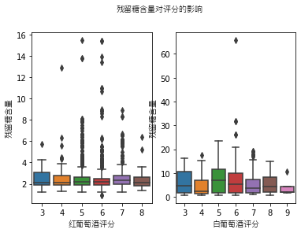
<center>图34 残留糖对评分影响图</center>

除去离群点，各分段的红葡萄酒的残留糖含量都比较相近，可以认为残留糖含量对红葡萄酒的评分影响不大。可以观察到8分红葡和3分红葡的残留糖含量分布区间很相近，而高浓度离群点主要出现在中间分段，不见于高分段和低分段。
类似地，除去离群点，各分段的白葡萄酒的残留糖含量都比较相近，可以认为残留糖含量对白葡萄酒的评分影响不大。可以观察到9分白葡和3分白葡的残留糖含量分布区间很相近，而高浓度离群点主要出现在中间分段，不见于高分段和低分段。

国标中有根据糖分的浓度对葡萄酒分类的标准，此处虽不严格复合（应以葡萄糖计），但也可按这个标椎大致看一下分类结果

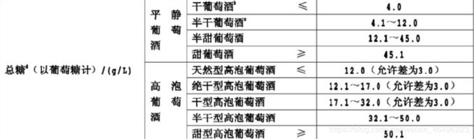

适用于柠檬酸的策略，同样的，我们以残留糖进行分类

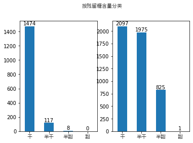
<center>图36 按残留糖分类图</center>

按照国标，实验中干红葡萄酒有1474例，占92.2%，半干红葡萄酒有117例，占7.3%，半甜红葡萄酒有8例，占0.5%，无甜红葡萄酒
实验中干白葡萄酒有2097例，占42.82%，半干白葡萄酒有1975例，占40.32%，半甜白葡萄酒有825例，占16.84%，甜白葡萄酒1例，占0.02%


**酒精分析**

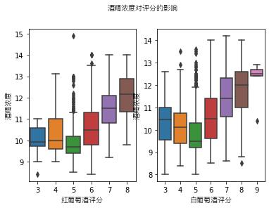
<center>图37 酒精浓度对评分影响图</center>

可以发现，对于红白葡萄酒而言，酒精浓度的上升会带来一定的评分上涨趋势，较高的酒精浓度更有可能带来较高的评分。

按国标标准，葡萄酒酒精浓度应不低于7.0
```python
(dfr[dfr['alcohol'] < 7]).alcohol.count()
(dfw[dfw['alcohol'] < 7]).alcohol.count()
```

此处按这个标椎做一下检查，可见均没有不符标准的情况。
- 补图37(结果截图)


##### 3.2.3 附加指标分析

**矿物盐**

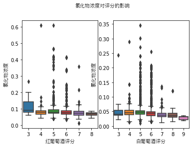
<center>图38 氯化物含量对评分影响图</center>

可以发现有一个微弱的随浓度降低评分上升的趋势，总体来说还是不算显著。但若出现较高浓度，则很有可能该评分处于中间分段。

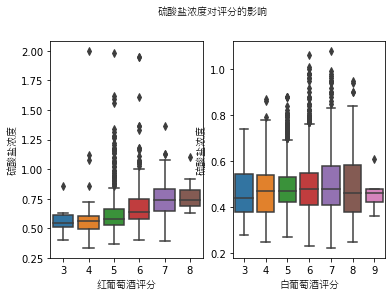
<center>图39 硫酸盐含量对评分影响图</center>


可以发现硫酸盐浓度对红葡萄酒的评分有一个较明显影响趋势，随着浓度增加更有可能得到一个较高的评分。

但是不能从硫酸盐浓度有效的估计白葡萄酒的评分，但若出现较高浓度，则很有可能该评分处于中间分段。


**二氧化硫**

首先看一下游离二氧化硫的占比以及其的影响情况

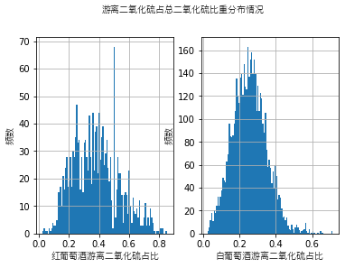
<center>图40 游离二氧化硫含量占比二氧化硫图</center>

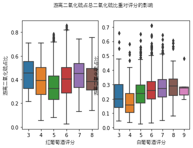
<center>图41 游离二氧化硫含量占比对评分影响图</center>

可以发现，仅从游离二氧化硫占总二氧化硫的比重无法有效估计红、白葡萄酒的评分情况。

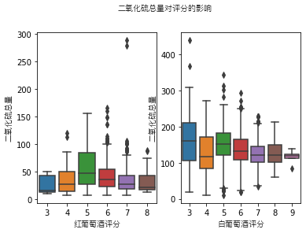
<center>图42 二氧化硫含量对评分影响图</center>

可以发现，仅从二氧化硫的总浓度亦无法有效估计红、白葡萄酒的评分情况，不过若出现高浓度二氧化硫，则有更大可能获得中间段评分。


##### 3.2.4 密度分析

除了之前在描述统计中看到的密度分布情况，这里可以进一步观察密度对评分的影响

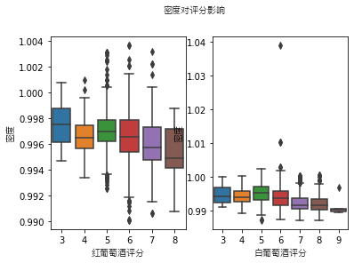
<center>图43 密度对评分影响图</center>

可以发现，对于红葡萄酒而言，随着密度的降低会有一个轻微的取得高分的趋势，而对于白葡萄酒而言，密度的变化并不会影响其评分情况。


#### 3.3 综合分析

##### 3.3.1 各变量间的关系

在上一个章节中选择性的查看了大部分输入变量对评分的影响，此处可以进一步将所有输入变量对评分的影响放在一起，类似于总结，可以有一个更加直观的视角。

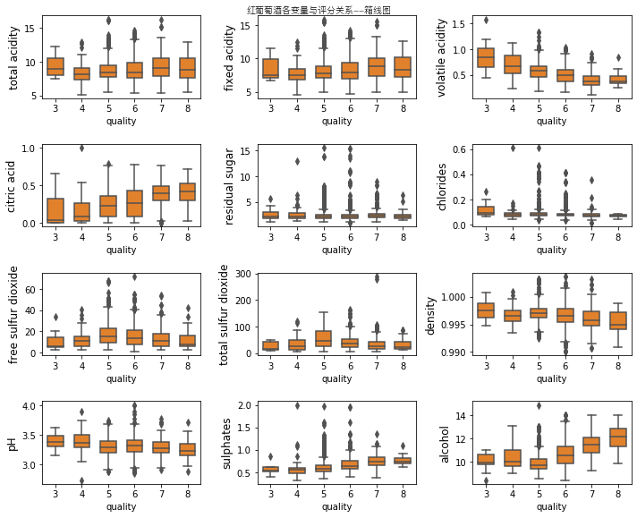
<center>图44 红葡各变量对评分影响图</center>

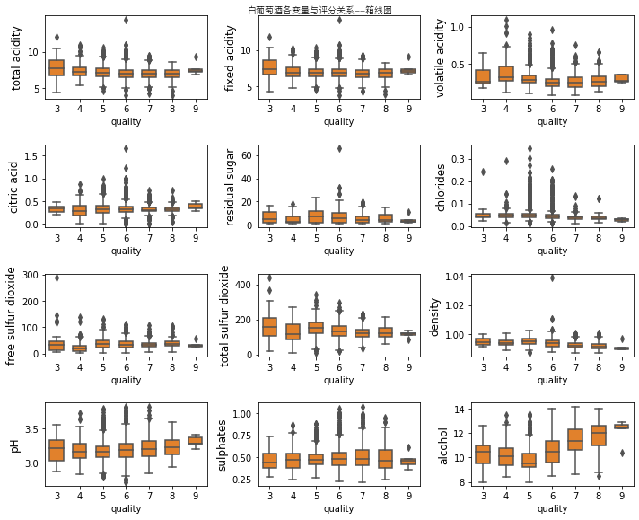
<center>图45 白葡各变量对评分影响图</center>

综上的直观可以较为清晰的看出各个变量对评分的影响

接下来看一下红白葡萄酒的热力相关图

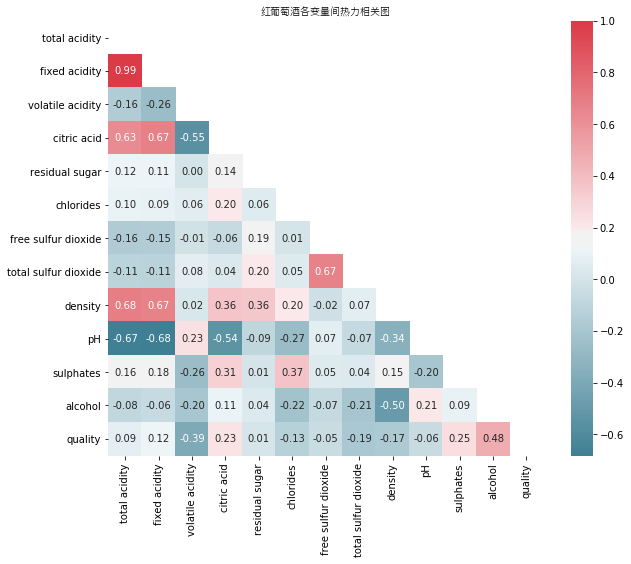
<center>图46 红葡热力相关图</center>

可以发现，就红葡萄酒quality得分与各输入变量的相关关系而言，与之前的读图分析结果基本保持一致，只不过是以数值形式进行了量化，此处不复赘述。
而各输入变量之间，可以发现：

- 总酸与固定酸、柠檬酸、密度有较强正相关，与pH有较强负相关；
- 固定酸与柠檬酸、密度有较强正相关，与pH有较强负相关；
- 挥发酸与柠檬酸有较强负相关；
- 柠檬酸与pH有较强负相关；
- 游离二氧化硫与二氧化硫总量有较强正相关；
- 密度与酒精有较强负相关

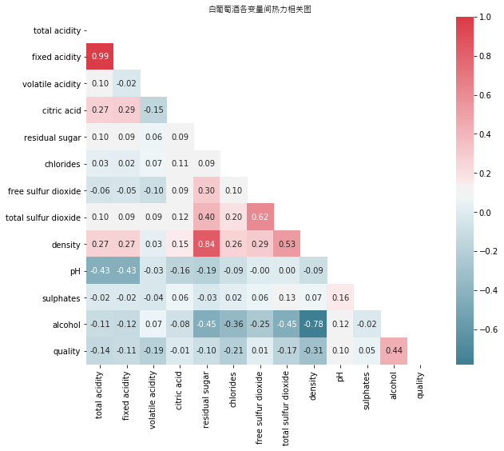
<center>图47 白葡热力相关图</center>

对于白葡萄酒类似地，各输入变量之间可以发现：

- 总酸与固定酸有较强正相关，与pH有较弱负相关；
- 固定酸与pH有较弱负相关；
- 残留糖浓度与密度有较强正相关，与酒精浓度有较弱负相关；
- 游离二氧化硫与二氧化硫总量有较强正相关；
- 二氧化硫总量与密度有较强正相关，与酒精有较弱负相关；
- 密度与酒精有较强负相关

各种酸之间的相关、酸与pH的相关以及游离二氧化硫和总二氧化硫的相关关系都易于理解。
而密度与酒精浓度的负相关可以进一步作图进行展示

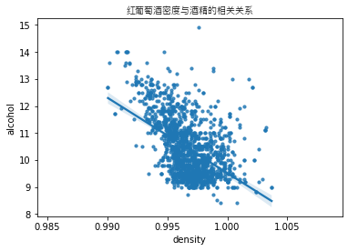
<center>图48 红葡密度与酒精相关图</center>

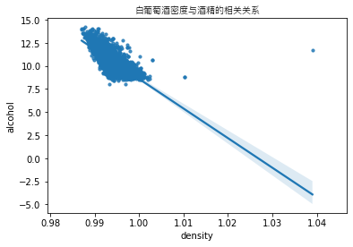
<center>图49 白葡密度与酒精相关图</center>

同理可以制作残留糖与酒精的相关关系

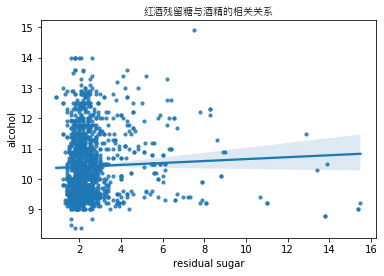
<center>图50 红葡残留糖与酒精相关图</center>

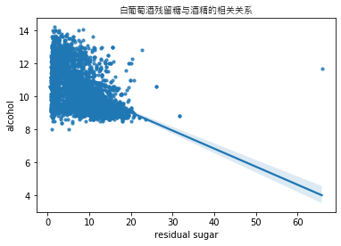
<center>图51 白葡残留糖与酒精相关图</center>


##### 3.3.2 主成分分析

前述分析中已经知道有些变量之间存在较强相关关系，这表示这些变量指代的含义可能出现重复，即存在浓缩变量的可能。
为验证想法，此处选择运用主成分分析（PCA）对输入变量进行降维，尝试找出具有代表性的少数几个新变量。因为各个变量之间度量单位不同且取值范围差异较大，故选择先将数据进行中心标准化处理，再对标准化的数据求解相关阵（也即协方差阵），进而求解特征值和特征向量。为避免高度重合，在计算之前要先将total acidity和quality这两列剔除出数据。

首先写出主题代码，封装成函数的形式。

```python
#输入变量主成分分析
"""
参数：
    - XMat：传入的是一个numpy的矩阵格式，行表示样本数，列表示特征
    - k：表示取前k个特征值对应的特征向量
函数解释：
    - pca_mat()：获取参与运算的多维数组
    - pca_eig()：返回满足要求的前k个特征值和特征向量
    - pca_coe()：返回主成分系数
    - pca()：返回每个样本的主成分得分
    - pca_draw()：返回前两个主成分得分的散点图
"""
def pca_mat(x):
    temp = x.drop(['quality','total acidity'],axis=1) #获取去除评分项的数据表
    XMat = np.array(temp) #dataframe格式转为多维数组
    average = np.mean(XMat,axis=0) #axis=0表示按照列来求均值
    standard = np.std(XMat,axis=0) #求每列标准差
    data_adjust = (XMat - average)/standard #中心标准化
    return data_adjust

def pca_eig(data_adjust):
    covmat = np.cov(data_adjust, rowvar=0)   #计算协方差矩阵
    eigVals,eigVects = np.linalg.eig(covmat)  #求解协方差矩阵的特征值和特征向量
    eigValInd = np.argsort(-eigVals) #按照eigVals进行从大到小排序（给出序号，不修改原特征值列表）
    """确定前k的主成分，使选取的主成分贡献90%以上的方差"""
    val_sum = 0
    val_total = eigVals.sum()
    for k in eigValInd:
        val_sum += eigVals[k]
        if val_sum/val_total < 0.90:
            continue
        else:
            break
    """分割线"""
    x = int(np.argwhere(eigValInd==k)+1) #定位k所在位置，结果加1
    eigValInd = eigValInd[:x:1] #截取前k个特征值的序号
    """取前k特征值"""
    list = []
    for i in eigValInd:
        list.append(eigVals[i])
    redEigVals = np.array(list)
    """对应前k的特征向量"""
    redEigVects = []
    for i in eigValInd:
        redEigVects.append(eigVects[i])
    redEigVects = np.array(redEigVects).T
    return redEigVals, redEigVects, eigVals, eigVects

def pca_coe(data_adjust):
    return pca_eig(data_adjust)[1]/(pca_eig(data_adjust)[0]**0.5)

def pca(data_adjust):
    lowDDataMat = np.matrix(data_adjust) * pca_eig(data_adjust)[1]
    return lowDDataMat

def pca_draw(data_adjust):
    df = pd.DataFrame(pca(data_adjust))
    plt.scatter(x=df[0], y=df[1])
    if data_adjust.sum() - pca_mat(dfr).sum() == 0:
        i = '红葡萄酒'
    else:
        i = '白葡萄酒'
    plt.title(f'{i}'+'主成分得分--散点图')
    plt.xlabel('第一主成分', fontsize=12)
    plt.ylabel('第二主成分', fontsize=12)
    plt.show()

"""红、白葡萄酒初始分析数据"""
pr = pca_mat(dfr)
pw = pca_mat(dfw)
```

在进行主成分分析的时候，有两点需要注意：

1. 变量间不能高度线性相关（故已提前提出明确已知的total acidity），特征值应不要出现十分接近0的情况，若存在则说明变量中存在严重的多重共线性，一定存在某些变量之间高度相关，此时的主成分分析效果将不是很理想。

2. 如果各变量之间相关性不大，主成分分析也不会获得理想的效果

对于第一点，经检查可以认为不存在特征值十分接近0的情况：

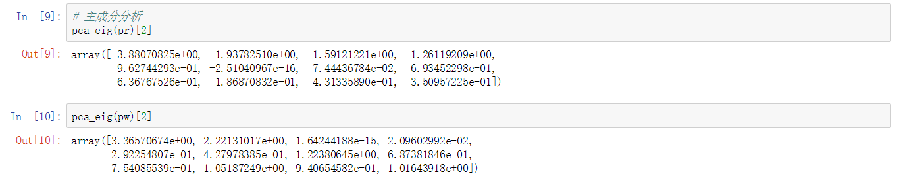

对于第二点，则需要看看在主成分覆盖90%以上方差的原则下，选取了多少个主成分，若降维效果理想则少数的2-3个主成分即可满足要求。然而如下图所示，在90%标准下，红葡萄酒选出了7个特征值即对应7个主成分，同理白葡萄酒选出了8个主成分，可见两者的主成分降维效果都不是很理想。

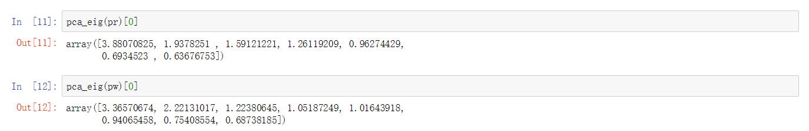

结合之前的热力相关图就可以理解，因为大部分变量之间的相关性都很低，具有较强相关的只有少数几个变量，结合上述主成分分析需注意的第二点就知道效果是肯定不会很理想的。

因为效果不理想，其实分析到这里就可以停止了。下面仅作展示将代码执行完成的结果：

- 主成分系数(解释为第K个主成分表示为11个输入变量的线性组合。可见很难清晰的描述除各主成分代表的含义)

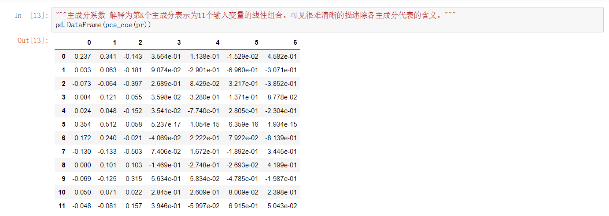
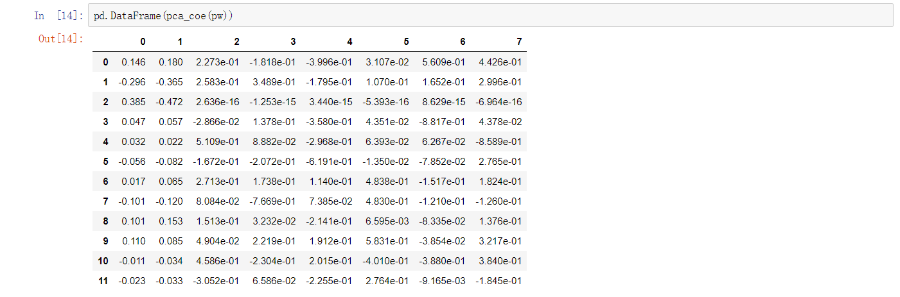

- 主成分得分(解释为每个样本点在主成分上投影的坐标)

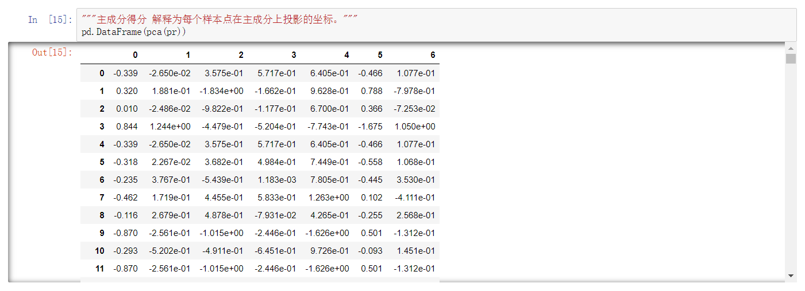
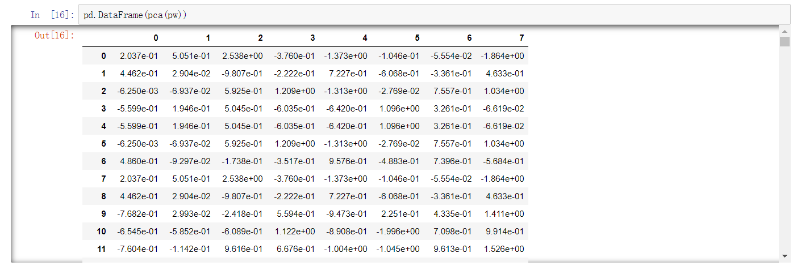

- 前两个主成分散点图

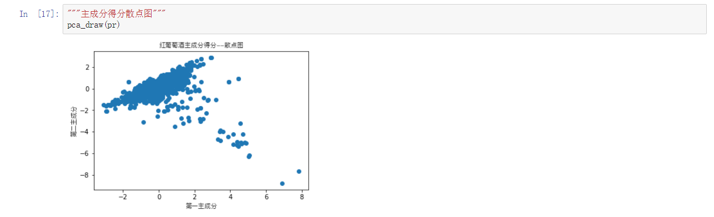
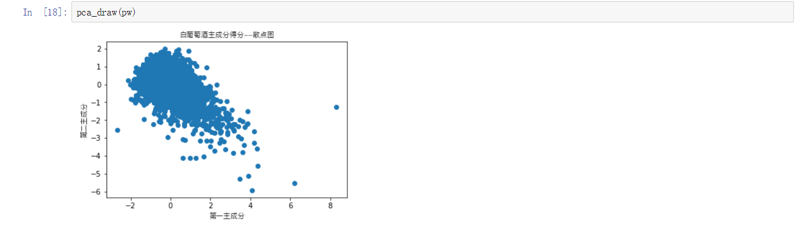


#### 3.4 数据总结

整体而言，11种输入变量对红葡萄酒的品质评分产生较多的影响，而对白葡萄酒则是在大多情况下无显著趋势，故在此猜测对白葡萄酒评分产生重要影响的另有因素，未在此次实验中被测量。

1. 从实验结果来看，红、白葡萄酒的对输入变量的反应可以总结为以下表格

| 变量指标   | 红葡萄酒          | 白葡萄酒     |
| :------: | ----           | --------     |
|  固定酸占总酸比分布情况   |   分布分散，多数>=88%   | 单峰分布，集中在97%附近    |
| 固定酸占比对评分影响 | 高占比易得高分 | 无显著趋势 |
| 柠檬酸占固定酸比分布情况 | 分散于0-8%，有很多0值 | 单峰分布，集中在4%附近 |
|  柠檬酸占比对评分影响  |   高占比易得高分  | 无显著趋势    |
| 挥发酸占总酸比分布情况 | 大多数分散于2.5%-12% | 单峰分布，集中在3%附近 |
| 挥发酸占比对评分影响 | 低占比易得高分 | 无显著趋势 |
| 总酸对评分影响 | 无显著趋势 | 无显著趋势 |
| pH对评分影响| 	低pH得高分，趋势微弱	| 高pH得高分，趋势微弱|
| 按柠檬酸分类	| 属于（干、半干、半甜）类	| 99%属于（干、半干、半甜）类，只有2例甜葡萄酒|
| 残留糖对评分影响	| 无显著趋势，高含量在中间分段| 	无显著趋势，高含量在中间分段|
|按残留糖分类	|干、半干、半甜	|干、半干、半甜、甜|
|酒精浓度对评分影响	|高浓度易得高分|	高浓度易得高分|
|氯化物对评分影响	|低浓度得高分，趋势微弱	|低浓度得高分，趋势微弱|
|硫酸盐对评分影响	|高浓度易得高分	|无显著趋势|
|游离二氧化硫占总量比分布情况	|分布分散大多数在10%-60%	|单峰分布，集中在25%附近|
|游离二氧化硫占比对评分影响	|无显著趋势	|无显著趋势|
|二氧化硫总量对评分影响	|无显著趋势	|无显著趋势|
|密度对评分影响|	低密度易得高分	|低密度易得高分|

2. 关于上表的总结如下
    + 红葡萄酒品质主要与固定酸含量（柠檬酸）、酒精浓度、硫酸盐浓度正相关，与挥发酸含量、pH值、氯化物浓度、密度负相关；
    + 白葡萄酒品质主要与pH值、酒精浓度正相关，与氯化物、密度负相关；
    + 对两种葡萄酒而言，总酸含量、残留糖含量、二氧化硫都是没有什么影响力的变量

3. 从变量样本分布情况来看，两种葡萄酒存在明显区别，故在成分含量上对红、白葡萄酒进行区分较为可行：


<center>图57 红白葡萄酒单变量直方图</center>

4. 11种输入变量之间普遍相关性不大，仅少数具有较高相关性，因此不具备理想的降维条件，无法将11种输入变量整合为少数几个综合变量（对红、白葡萄酒均是如此）。


## 四 总结

以上，我们用了一些篇幅介绍了我们的工作，主要可以总结为以下几点：

+ 发掘了Python的多种用途，多方面实现了数据可视化
+ 将课堂所学运用其中，并进行了一定程度的拓展
+ 分析一个整体的案例

通过这次的作业，我们第一次认识到了该怎样去分析数据，去得出结论，以及如何再对得出的结论进行验证。我们有许许多多的方法对数据进行分析，但随着数据量的加大，我们开始求助于计算机来解决。对Python的合理应用让处理超大数据集变成了可能，使我们不再受拘于数据整理，而是专注方法的思考和完善。因此想做一个数据科学工作者，既要求对编程技术熟练掌握，也需要数学知识的深厚功底。


## 五 参考资料

《Python机器学习基础教程》 Andreas C. Müller，Sarah Guido著，张亮译，人民邮电出版社

《Python数据分析基础》 Clinton W. Brownley著，陈光欣译，人民邮电出版社

 国内外博客、教学视频

所用数据集均源自网络

本项目所有代码和资料均在github开源，仓库地址：https://github.com/JHSUYU/final_python.git