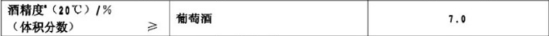

# <center>Python数据分析报告</center>

## 一 前言

​		在数据科学越来越重要的当今社会，对庞大的数据进行分析，处理，找出数据中存在的客观规律，建立描绘群体行为的数学模型，从而对群体行为作出预测，已成为促进社会进步的重要手段。

​		Python编程语言凭借其方便的功能库，精简，易操作的语言风格，在众多编程语言中脱颖而出，成为当今社会进行数据分析的一把利器。

​		而我们认为，Python进行数据分析的重要方式之一是**数据可视化**。

​		本论文讨论了Python在数据分析中如何利用自身的语言优势进行数据可视化并与概率统计知识相结合，从而直观地呈现出现实世界中的一些事件，事件背后的原因，以及事件未来可能的发展。


## 二 Python数据可视化初步

### 2.0 概述

​		在论文第二部分，主要初步介绍Python是如何进行数据可视化的。

​		2.1介绍了数据可视化的概念，即将事件或数据集以图表的形式进行反映，让观看者能够看明白其含义，发现数据集中原本未意识到的规律和意义。

​		2.2介绍了Python如何将常见的数据格式CSV和JSON进行可视化。

​		2.3介绍了Python怎样与API结合来可视化。


### 2.1 数据可视化的概念

​		我们通过运用Python描述日常生活中的现象来解释数据可视化的概念

#### 案例1 利用Matplotlib库

​		本案例来进行绘制散点图模拟水分子无规则运动。如图1，水分子从原点出发，进行5000次任意方向的运动，图上的5000个点代表每次运动后的位置，使水分子无规则运动的路径通过散点图进行呈现，按时间顺序，颜色越深的越晚发生。


<center>图1 水分子进行5000次运动的位置图</center>

​		从图1可以看出，比起大量数据，通过这些数据生成的散点图可以很直观地模拟出水分子的一个大致运动范围，而毫无规律可循的位置图可以帮助理解水分子运动的“随机”的概念。


#### 案例2 利用Pygal库

​		本案例中统计扔1000次骰子后各点数出现的次数，将其绘制成条形图，如图2所示。


<center>图2 扔1000次骰子后各点数出现的次数</center>

​		条形图可以清楚地对各个次数进行比较，以看出差别。这里取的样本还是偏小，不足以描绘出接近正确的结果


### 2.2 数据可视化与csv和json文件的结合

​		csv文件，即Comma-Separated Values，即逗号分隔值。csv文件是以纯文本的形式来存储表格数据，有时候是数字，有时候是文本。如果只是单纯地人工去分析处理csv文件，是非常困难的，而Python有着非常优秀处理csv文件的能力，只需将文件导入，库中提供的方法会帮助完成分析数据的任务。

​		json文件是一个序列化的对象或是数组，通常应用于前端的数据解析。Python也可以用来解析它们，进行可视化的工作。

​		下面用两个案例来详细说明Python是如何将上述两种文件进行可视化的。

#### 案例3 处理csv文件

​		从天气网站上获得伦敦与多伦多两个地区天气的历史数据并把它们存储为csv格式文件，利用Python获取两个地区每日的最高气温和最低气温，并将气温数据转化为图表进行对比。csv文件如图3所示。


<center>图3 伦敦天气数据（部分）</center>

​		将两个地区一年中每日的最高气温与最低气温分别绘制成图表，如图4和图5所示


<center>图4 伦敦一年中每日最高与最低气温图表</center>

​		同理，我们可以画出多伦多一年中的每日最高温与最低温图表


<center>图5 多伦多一年中每日最高与最低气温图表</center>

​		

#### 案例4 处理json文件

​		图6所示为我们从外部网站获取到2017年全年的股票每日收盘价，是以json文件的格式存储的。我们将利用Python来对这些数据进行分析，进而得出一些结论。


<center>图6 2017年全年股票收盘价（部分）</center>

​		第一步，我们绘制出股票收盘价的折线图。利用2.1中提到的Pygal库


<center>图7 2017年全年股票收盘价折线图</center>

​		从收盘价的折线图可以看出，2017年的总体趋势是非线性的，而且增长幅度不断增大，似乎呈现出指数分布。我们同时发现，在每个季度末,股票收盘价似乎有一些相似的波动。为了验证波动的周期性，我们使用对数变换消除了非线性的趋势。


<center>图8 股票收盘价对数变换折线图</center>

​		用对数变换剔除非线性趋势后，整体上涨的趋势更接近线性增长。从图8可以看出，收盘价在3月，6月，9月，即每个季度末都出现了剧烈的波动。为了进一步探求股票价格变化规律的周期性，我们绘制了收盘价的月日均值，周日均值，以及星期均值，分别为图9，图10和图11。


<center>图9 股票收盘价月日均值折线图</center>


<center>图10 股票收盘价周日均值折线图</center>


<center>图11 股票收盘价星期均值折线图</center>


### 2.3 与API的结合

​		Web API是网站的一部分，用于与使用非常具体的URL请求特定信息的程序交互。这种请求称为API调用。我们通过Python的reqeust包执行API调用，来获取网站上的数据，进而开始可视化处理。

#### 案例5 得到Github上star数最多的Python项目

​		我们将从Github提供的API中获取到的数据存储在字典中，分析字典中的信息，将所有的Python项目按星从高到低排序，创建一个交互式条形图。处理后所得到的如图12所示。


<center>图12 GitHub上受欢迎程度最高的Python项目</center>

​		当我们将鼠标移动到某一条上，就会自动显示出对应的总数，可以看出star数最多的项目是system-design-primer，可以进一步查看star数达到了100857个。


## 三 从实际案例总体来看数据可视化

​		第一和第二部分我们介绍了Python关于数据可视化的基本概念，简单理解了其应用。接下来我们将通过完整地分析几个实际案例来展现出如何利用Python进行数据可视化，期间我们也会用到一些数据分析的方法。

​		注：数据集源自网络

### 案例6 葡萄酒品质案例

#### 1. 问题描述

​		数据集存储在源代码文件夹中，包括两种葡萄酒，分别是红葡萄酒和白葡萄酒，还包括了一个数据集说明，这里简单概括一下：

1. 数据量方面，红葡萄酒有1599条记录，白葡萄酒有4898条记录。

2. 输入内容包括客观测试（一共11个，例如有pH值等），输出内容基于感官数据（葡萄酒专家至少进行3次评估的中位数）。每位专家都将葡萄酒的质量评定为0（非常差）至10（非常好）。

3. 关于输入信息说明如下（基于理化性质）：

    + fixed acidity：固定酸
    + volatile acidity：挥发性酸
    + citric acid：柠檬酸
    + residual sugar：残留糖
    + chlorides：氯化物
    + free sulfur dioxide：游离二氧化硫
    + total sulfur dioxide：二氧化硫总量
    + density：密度
    + pH：酸碱值
    + sulphates：硫酸盐
    + alcohol：酒精

    关于输出信息说明如下（基于感官数据）：

    + quality (介于0到10之间)：品质

4. 此外，数据集说明中还提到了一些相关信息，主要可以概括为，葡萄酒的质量并不是均匀分布的，普通的葡萄酒要远多于劣质葡萄酒或优质葡萄酒，因此离群值检测算法可用于检测少数优质或劣质葡萄酒。


#### 2. 思路分析

​		由于本案例是对葡萄酒进行分析，所以我们要对葡萄酒的标准做一些事先了解：

​		（以下部分信息来自葡萄酒新国家标准GB15037-2006）

1. 葡萄酒的基本特征主要有酸度、单宁、酒精和甜味。当这四种特征处于一个良好的平衡状态时，葡萄酒的品质才会最优质

2. 酸主要可分为固定酸和挥发酸，常说的总酸就是两者的总和。葡萄酒中含有许多种酸，主要是酒石酸、苹果酸、柠檬酸、琥珀酸、乳酸、醋酸，挥发酸是葡萄酒中以游离状态或以盐的形式存在的所有乙酸等脂肪酸的总和，但不包括乳酸、琥珀酸以及CO~2~和SO~2~，其中醋酸是主要的挥发酸。挥发酸的含量是葡萄酒健康状态的“体温表”，因为它是发酵、贮藏管理不良留下的标记，通过挥发酸含量的测定可以了解葡萄酒是否生病、病害的严重性以及预测贮藏的困难程度。在国标中对挥发酸和柠檬酸做了明确规定。

    

<center>图13 新国标中对挥发酸和柠檬酸的规定</center>

​		注：总酸不作要求，以实测值表示（以酒石酸记，g/L）

3. pH值是衡量葡萄酒中酸度的程度，一般来说，白葡萄酒的酸度一般在3.1至3.5之间，高于红葡萄酒的3.5至4的区间值。相较而言酸度是衡量葡萄酒中酸含量的多少。

4. 一般来说，酸度对葡萄酒口感的影响要大于pH值，但如果pH值位于一个极端的位置，就会产生较大的影响。总酸度是告诉我们这款酒的浓度，而pH值显示的是这款酒品尝起来口感的浓郁度。例如，在pH值相同的情况下，一款总酸度为6g/L的葡萄酒品尝起来会比总酸度为4g/L的葡萄酒更酸。

5. 残留糖分（简称残糖）是衡量葡萄酒中甜度的标准。通常，残留糖分低于4克/升的葡萄酒为干型葡萄酒，许多干型葡萄酒几乎不含残糖。

    

    	<center>图14 新国标中对糖分的标准</center>

6. 酒精度指葡萄酒中所含酒精的百分比，大部分葡萄酒的酒精度都在10-15%之间，但也有些特殊的葡萄酒，如阿斯蒂（Moscato d’Asti）（酒精度非常低），波特酒（Port）（酒精度非常高）。

    

    <center>图15 新国标中对酒精度的规定</center>

7. 氯化物和硫酸盐都属于葡萄酒中的矿物盐成分，一般来说含量分别是0.1-0.4g/L和0.25-0.85g/L。值得一提的是，虽然这些矿物质成分存在葡萄酒中且可以增强葡萄酒的风味，但它们并不是某些葡萄酒带有矿物风味的主要原因。一般而言，红葡萄酒所含的矿物质多于白葡萄酒。

8. 并不是所有葡萄酒中都会有二氧化硫，但二氧化硫能起到如杀菌、抗氧化、澄清酒液和提高色素和酚类物质含量等作用，因此一般葡萄酒中或多或少地带有一定的二氧化硫，只是整体而言其含量非常少，多为 80-200mg/L，个别葡萄酒中还含有 10-50mg/L 的游离态二氧化硫。不过，适当的摇杯或者醒酒等可以令其挥发掉，因此几乎可以忽略不计。

    

    <center>图16 新国标中对二氧化硫的规定</center>

总结：根据查到的信息，更新输入变量表格如下

|       输入指标       |         说明         |         备注         |
| :------------------: | :------------------: | :------------------: |
|    fixed acidity     |    固定酸（g/L）     |     总酸组成之一     |
|   volatile acidity   |   挥发性酸（g/L）    |     总酸组成之一     |
|     citric acid      |    柠檬酸（g/L）     |      属于固定酸      |
|    residual sugar    |    残留糖（g/L）     |     基本指标之一     |
|      chlorides       |    氯化物（g/L）     |      矿物盐成分      |
| free sulfur dioxide  | 游离二氧化硫（mg/L） |      防腐保鲜剂      |
| total sulfur dioxide | 二氧化硫总量（mg/L） |      防腐保鲜剂      |
|       density        |     密度（g/ml）     |          略          |
|          pH          |        酸碱值        | 酸度的另一种测量角度 |
|      sulphates       |    硫酸盐（g/L）     |      矿物盐成分      |
|       alcohol        |    酒精 （%vol）     |     基本指标之一     |

由此可知，11种输入变量可以大致划分成三类，第一类是基本指标及其内含的个别具体指标，第二类是附加指标（矿物盐、二氧化硫），第三类是密度这个物理性质。


#### 3. 数据分析

##### 3.1 数据整理

使用语言为Python，编程工具为PyCharm和Jupyter Notebook

首先我们导入需要用到的库

```python
import numpy as np
import pandas as pd
import matplotlib.pyplot as plt
import seaborn as sns
from matplotlib import font_manager
```

然后我们进行对数据集文件的读取，文件存放位置与代码目录相同

```python
dfr = pd.read_csv(r'winequality-red.csv', sep=';')
dfw = pd.read_csv(r'winequality-white.csv', sep=';')
```

在打印数据之前，我们还需要对输出格式进行一些处理

```python
# 颜色
color = sns.color_palette()
# 数据print精度
pd.set_option('precision', 3)
# 显示完整的列
pd.set_option('display.max_columns', None)
# 显示完整的行
pd.set_option('display.max_rows', None)
# 设置字体
my_font = font_manager.FontProperties(fname="苹方字体.ttf")
```

我们先打印出两个数据集的head部分


<center>图17</center>

因为总酸作为葡萄酒基本指标值之一，是固定酸和挥发酸的合，所以可以在表中增加一列"total acid"作为总酸，并放置在表格首列：

```python
#增加总酸
dfr['total acid'] = dfr['fixed acidity'] + dfr['volatile acidity']
dfw['total acid'] = dfw['fixed acidity'] + dfw['volatile acidity']
#移动dfr总酸到列首
r = dfr.columns.tolist()
r.insert(0,r.pop())
dfr = dfr.reindex(columns=r)
#移动dfw总酸到列首
r = dfw.columns.tolist()
r.insert(0,r.pop())
dfw = dfw.reindex(columns=r)
```

这样数据集就变成了：


<center>图18</center>

因为不存在值必须唯一的变量且需要分析分类数量，故此处不对数据集进行去重（经试验两个数据集都存在一定数量的重复值），而且经检查不存在异常值。


##### 3.2 分类讨论

11种输入变量可以大致划分成三类，第一类是基本指标及其内含的个别具体指标，第二类是附加指标（矿物盐、二氧化硫），第三类是密度这个物理性质。

**数值描述**

参考图18

由上面结果首先可以知道参与测试的红葡萄酒获得的评分分布在3-8分，白葡萄酒在3-9分，且各分位数数据一致，这说明两种葡萄酒的品质在大体上无明显区别，但具体是否存在细节上的差距还需要进一步分析。另外对于输入变量的各参数，数据表格展示的形式太繁杂不直观，一时看不出什么信息，需要进一步加工成图像便于分析比对。


**箱线图**

我们来绘制两种葡萄酒每个变量的箱线图

```python
# 红葡单变量箱线图
colnum_red = dfr.columns.tolist()
plt.figure(figsize=(10, 6), dpi=200)
plt.suptitle('红葡萄酒单变量箱线图', y=1.00, fontproperties=my_font)  # 总标题
# 画第一行的图
for i in range(7):
    plt.subplot(2, 7, i + 1)
    sns.boxplot(dfr[colnum_red[i]], orient="v", width=0.4, color=color[0])
    plt.ylabel(colnum_red[i], fontsize=12)
plt.tight_layout()
# 画第二行的图
for i in range(6):
    plt.subplot(2, 6, i + 7)
    sns.boxplot(dfr[colnum_red[i + 7]], orient="v", width=0.4, color=color[0])
    plt.ylabel(colnum_red[i + 7], fontsize=12)
plt.tight_layout()
plt.show()
```


<center>图19 红葡萄酒单变量箱线图</center>

（注：这里会报一个warning，但是对结果没有影响）

结合箱线图和刚才的数据表格可以直观了解到各个变量的分布特征，大致归纳如下

| 红葡萄酒变量         | 分布特征                                                     |
| :------------------- | ------------------------------------------------------------ |
| total acidity        | 整体呈正偏，尾长较为对称，高浓度部分存在一定量离群点         |
| fixed acidity        | 整体呈正偏，尾长较为对称，高浓度部分存在一定量离群点，整体分布与总酸相近 |
| volatile acidity     | 整体呈正偏，尾长较为对称，高浓度部分存在一定量离群点，浓度范围低总酸一个数量级 |
| citric acid          | 整体呈正偏，上尾长较长，最小值取到0，有极个别离群点取到1     |
| residual sugar       | 整体呈高度正偏，尾长较为对称，存在大量高浓度离群点           |
| chlorides            | 整体呈高度正偏，尾长较为对称，存在少量低浓度离群点和大量高浓度离群点 |
| free sulfur dioxide  | 整体呈正偏，上尾长较长，存在一定量高浓度离群点               |
| total sulfur dioxide | 整体呈正偏，上尾长较长，存在一定量高浓度离群点且离群点间断大 |
| density              | 整体几乎呈正态分布，上下各有一定量离群点                     |
| pH                   | 整体呈轻度正偏，尾长较为对称，存在少量低值离群点和一定量高值离群点 |
| sulphates            | 整体呈正偏，尾长较为对称，存在较多高浓度离群点               |
| alcohol              | 整体呈正偏，上尾长较长，存在少量高浓度离群点                 |
| quality              | 整体几乎呈正态分布，上下各有极少量离群点                     |

可以大致总结知道，对于红葡萄酒而言，除密度和评分这两项数据分布均匀呈正态之外，其他所有变量都呈现出不同程度的正偏分布，这说明大多数变量都存在可控下限却没有明确的上限，由于品质波动都可能出现较高取值的情况。

同理，我们画出白葡萄酒单变量箱线图

```python
# 白葡单变量箱线图
colnum_white = dfw.columns.tolist()
plt.figure(figsize=(10, 6))
plt.suptitle('白葡萄酒单变量箱线图', y=1.00, fontproperties=my_font)  # 总标题
# 画第一行的图
for i in range(7):
    plt.subplot(2, 7, i + 1)
    sns.boxplot(dfw[colnum_white[i]], orient="v", width=0.4, color=color[0])
    plt.ylabel(colnum_white[i], fontsize=12)
plt.tight_layout()
# 画第二行的图
for i in range(6):
    plt.subplot(2, 6, i + 7)
    sns.boxplot(dfw[colnum_white[i + 7]], orient="v", width=0.4, color=color[0])
    plt.ylabel(colnum_white[i + 7], fontsize=12)
plt.tight_layout()
plt.show()
```


<center>图20 白葡萄酒单变量箱线图</center>

我们也可以得到白葡萄酒各个变量的分布特征

| 白葡萄酒变量         | 分布特征                                                     |
| -------------------- | ------------------------------------------------------------ |
| total acidity        | 整体呈正偏，尾长较为对称，存在少量低离群点和一定量高离群点   |
| fixed acidity        | 整体呈正偏，尾长较为对称，存在少量低离群点和一定量高离群点，整体分布与总酸相近 |
| volatile acidity     | 整体呈正偏，尾长较为对称，存在大量高离群点，浓度范围低总酸一个数量级 |
| citric acid          | 整体呈正偏，尾长较为对称，存在少量低离群点和一定量高离群点   |
| residual sugar       | 整体呈正偏，上尾长较长，存在少量高浓度离群点且离群点间断大   |
| chlorides            | 整体呈高度正偏，尾长较为对称，存在少量低浓度离群点和大量高浓度离群点 |
| free sulfur dioxide  | 整体呈正偏，上尾长较长，存在一定量高浓度离群点且离群点间断大 |
| total sulfur dioxide | 整体呈正偏，尾长较为对称，存在少量低离群点一定量高浓度离群点 |
| density              | 整体呈轻度正偏，存在极少量高离群点                           |
| pH                   | 整体呈轻度正偏，尾长较为对称，存在少量低离群点和一定量高离群点 |
| sulphates            | 整体呈正偏，尾长较为对称，存在较多高浓度离群点               |
| alcohol              | 整体呈正偏，上尾长较长，无离群点                             |
| quality              | 整体几乎呈正态分布，上下各有极少量离群点                     |

可以发现白葡萄酒也是在绝大部分变量上呈现正偏分布，且相比红葡萄酒有更多变量有低离群点，整体上红葡萄酒和白葡萄酒在一些变量上表现不太相同，这些指标可能是造成品类不同的主要因素之一。

我们接下来将两个箱线图放在一起进行观察，可以得出以下结论：

+ 在酸度上白葡萄酒取值低于红葡萄酒且分布更紧凑；
+ 在残留糖浓度上白葡萄酒分布更广泛，相比之下红葡萄酒的分布就很紧凑；
+ 在氯化物浓度上白葡萄酒取值低于红葡萄酒，二者的分布都比较分散；
+ 在二氧化硫浓度上白葡萄酒取值高于红葡萄酒；
+ 在密度上二者的绝大部分取值均低于水的密度，白葡萄酒整体密度更低但分布范围更大；
+ 在pH上二者整体分布相似，白葡萄酒取值整体低于红葡萄酒；
+ 在硫酸盐酸浓度上白葡萄酒整体取值低于红葡萄酒；
+ 在酒精浓度上二者分布相近且离群点很少；
+ 在品质评分上二者十分相近，除白葡萄酒有9分取值外几乎无异；


**直方图**


##### 3.3 综合分析